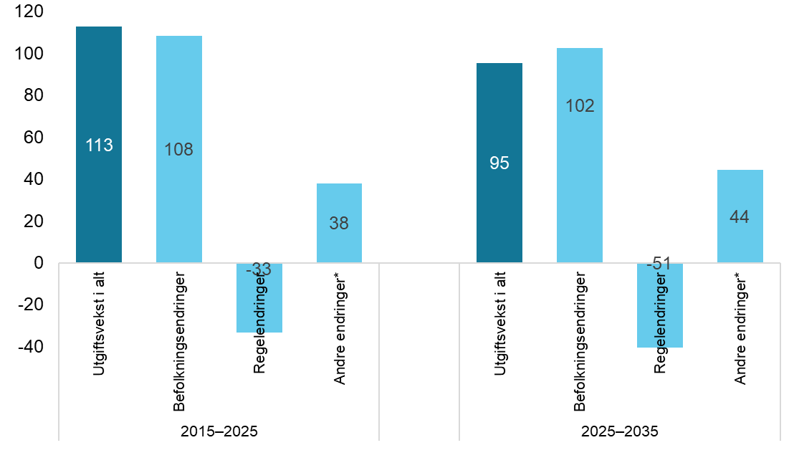
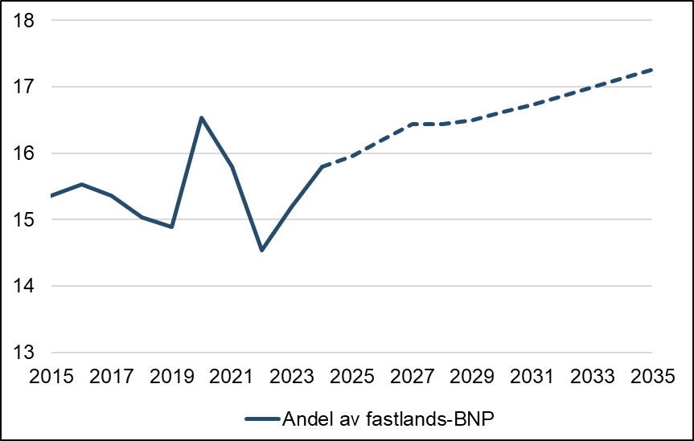
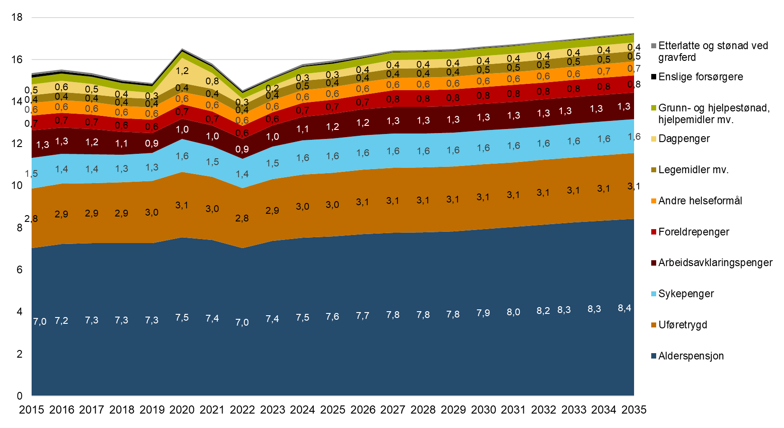
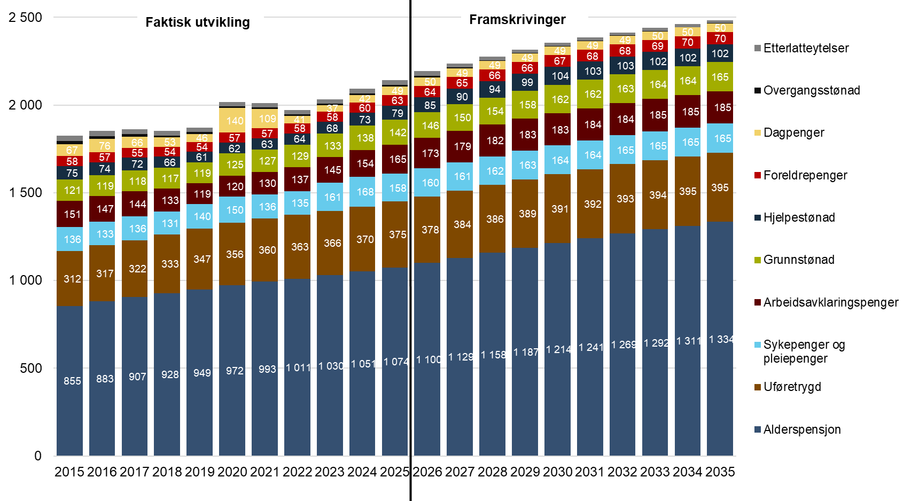
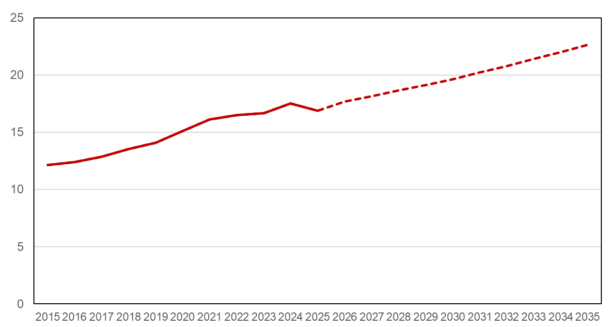
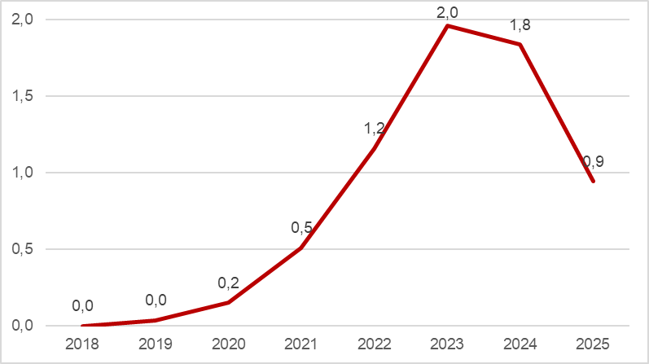
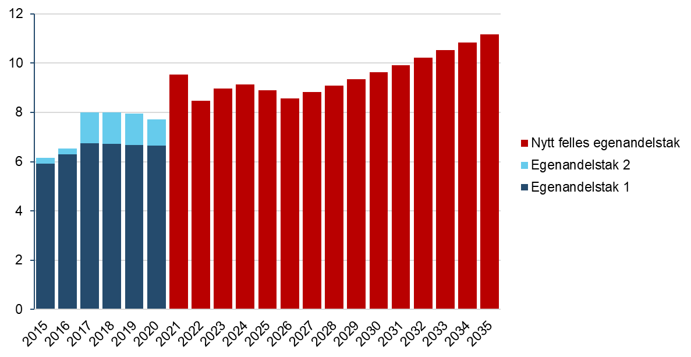
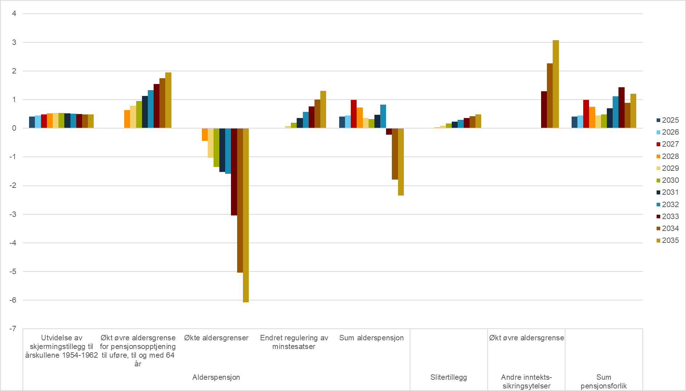
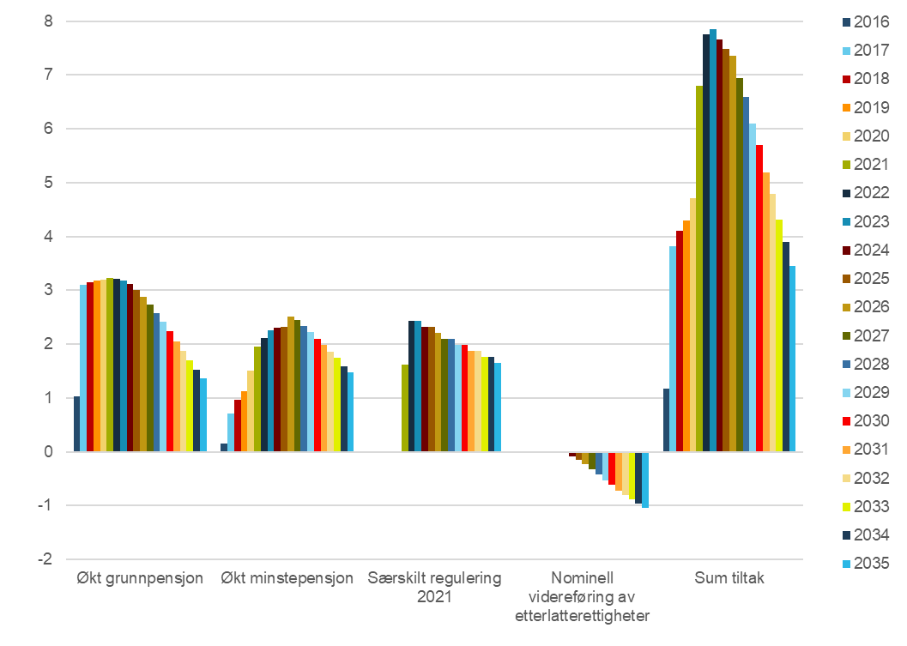

**Utviklingstrekk i folketrygden 2015–2035**

<u>  
</u>

Innhold

[1. Sammendrag [3](#_Toc149137899)](#_Toc149137899)

[2. Innledning [5](#_Toc149137900)](#_Toc149137900)

[2.1 De viktigste endringene fra 2025-rapporten [5](#_Toc149137901)](#_Toc149137901)

[Forutsetninger og metoder for framskrivingene [7](#_Toc223446980)](#_Toc223446980)

[3. Overordnede utviklingstrekk [11](#_Toc149137903)](#_Toc149137903)

[3.1 Utviklingen fra 2015 til 2025 [11](#_Toc18670095)](#_Toc18670095)

[3.2 Utviklingen fra 2025 til 2035 [17](#_Toc18670096)](#_Toc18670096)

[4. Helserelaterte ytelser [20](#_Toc149137907)](#_Toc149137907)

[4.1 Utviklingen fra 2015 til 2025 [20](#_Toc149137908)](#_Toc149137908)

[4.2 Utviklingen fra 2025 til 2035 [26](#_Toc149137909)](#_Toc149137909)

[5. Helsetjenester [27](#_Toc149137911)](#_Toc149137911)

[5.1 Legemidler mv. [27](#_Toc149137912)](#_Toc149137912)

[5.2 Egenandelstak (frikortordningen) [31](#_Toc223446989)](#_Toc223446989)

[6. Alderspensjon [34](#_Toc18670097)](#_Toc18670097)

[6.1 Nærmere om utviklingen i alderspensjonsutgiftene [35](#_Toc18670098)](#_Toc18670098)

[6.2 Utgiftsvirkning av pensjonsreformen [38](#_Toc223446992)](#_Toc223446992)

[6.3 Virkninger av pensjonsforliket [40](#_Toc223446993)](#_Toc223446993)

[6.4 Utgiftsvirkninger av andre politiske tiltak [44](#_Toc18670100)](#_Toc18670100)

[Referanser [48](#_Toc223446995)](#_Toc223446995)

[Vedlegg: Utviklingen i folketrygdens utgifter deflatert med konsumprisindeksen (KPI) [50](#_Toc149137920)](#_Toc149137920)

  

1.  Sammendrag

Rapporten viser utgiftsutviklingen i folketrygden i perioden 2015–2025 og framskrivinger til 2035 samt hvordan befolkningsendringer og regelendringer påvirker utviklingen. Det er befolkningsendringer som påvirker mest, men også regelendringer har hatt betydelig innvirkning.

Målt i realverdi i 2026-kroner[^1] har utgiftene til folketrygden økt med 113 milliarder kroner fra 2015 til 2025, til 736 milliarder kroner. Fra 2025 til 2035 venter vi at utgiftene vil øke med ytterligere 95 milliarder kroner til 831 milliarder kroner. Som andel av fastlands-BNP tilsvarer det en økning fra 15,4 prosent i 2015 til 16,0 prosent i 2025. Fram til 2035 ventes andelen å øke vesentlig til 17,3 prosent. Veksten i utgiftene på statsbudsjettet har vært sterkere enn veksten i folketrygdens utgifter de siste årene. Som andel av statsbudsjettet har derfor folketrygdens utgifter gått ned, fra 35,7 prosent i 2015 til 33,9 prosent i 2025. I 2026 venter vi at andelen vil øke noe igjen, til 34,4 prosent.

Økte utgifter til alderspensjon utgjør en stor del av utgiftsveksten. Her har utgiftene i realverdi økt med 65 milliarder kroner siden 2015, til 351 milliarder kroner i 2025. Fram til 2035 venter vi en ytterligere økning på 56 milliarder kroner. For helsetjenester har realveksten vært 9 milliarder kroner, og vi venter en ytterligere realvekst på 15 milliarder kroner (31 prosent) til 61 milliarder kroner i 2035. 6 milliarder kroner av veksten gjelder legemidler, mens 8 milliarder kroner gjelder andre helseformål. Veksten skyldes befolkningsvekst, økt etterspørsel etter helsetjenester og legemidler, flere behandlere og vridning mot nye og dyrere legemidler.

Utgiftene til helserelaterte trygdeytelser, det vil si sykepenger, arbeidsavklaringspenger og uføretrygd, har fra 2015 til 2025 økt med 42 milliarder kroner til 269 milliarder kroner. Veksten kan i hovedsak forklares av økte utgifter til uføretrygd og sykepenger, der økningen har vært henholdsvis 25 og 15 milliarder kroner. Samlet er veksten 18 milliarder kroner høyere enn hva befolkningsvekst og endret alderssammensetning av befolkningen skulle tilsi. Fram til 2035 ventes utgiftene til disse ytelsene å øke med 20 milliarder kroner til 289 milliarder kroner. Det er rundt 10 milliarder kroner mer enn hva befolkningsendringer tilsier. Det skyldes en trend de siste årene med særlig høy vekst i bruken av arbeidsavklaringspenger, og som også gir økt tilstrømming til uføretrygd. Sykefraværet har også økt mye, men her venter vi ikke ytterligere økning.

Befolkningsvekst og endret alderssammensetning kan forklare størstedelen av utgiftsveksten i folketrygden, og det skyldes særlig aldring av befolkningen. Befolkningsendringer har bidratt til 108 milliarder kroner av utgiftsveksten på 113 milliarder kroner fra 2015 til 2025, og ventes å bidra til ytterligere 102 milliarder kroner av forventet utgiftsvekst på 95 milliarder kroner fra 2025 til 2035. Regelendringer har gitt en innsparing i 2025 sammenliknet med 2015 på 33 milliarder kroner. Dette gjelder i stor grad alderspensjon der regelendringer har gitt 34 milliarder kroner i innsparing, hvorav pensjonsreformen har gitt en innsparing på 39 milliarder kroner, mens andre regelendringer (økt grunnpensjon, og flere økninger av minste pensjonsnivå) har gitt merutgifter på 5 milliarder kroner.

Av utgiftsveksten fra 2015 til 2025 er det 38 milliarder kroner som verken kan forklares av befolkningsendringer eller regelendringer. Her gjelder 20 milliarder kroner alderspensjon, og det skyldes særlig effekten av at økt sysselsetting blant kvinner har gitt høyere pensjonsopptjening. Også for uføretrygd, sykepenger og legemidler har utgiftene økt klart mer enn befolkningsendringer og regelendringer skulle tilsi, og dette utgjør henholdsvis 8, 6, og 5 milliarder kroner på disse ordningene. Dette skyldes høy tilstrømming til uføretrygd blant personer som har mottatt arbeidsavklaringspenger (særlig i årene før koronapandemien), sterk vekst i sykefraværet, og økt forbruk av legemidler samt vridning mot nye og dyrere produkter. Dagpenger og stønader til enslige forsørgere har økt 6 og 3 milliarder kroner mindre enn hva befolkningsvekst og regelendringer tilsier. Det skyldes lavere arbeidsledighet, samt nedgang i fødselstall og antall enslige forsørgere, samt at enslige forsørgere jobber mer enn tidligere.

Fra 2025 til 2035 vil vedtatte regelendringer og pensjonsforliket bidra til en utgiftsnedgang på 50 milliarder kroner. Det gjelder hovedsakelig alderspensjon (-51 milliarder kroner), uføretrygd (+1,9 milliarder kroner) og stønader til enslige forsørgere (-1,3). For alderspensjon gjelder dette i hovedsak pensjonsreformen og pensjonsforliket i 2024. For uføretrygd gjelder det pensjonsforliket (som gir økt øvre aldersgrense for uføretrygd) og økningen i fribeløpet til 1 G. For stønader til enslige forsørgere gjelder det at ordningen blir avviklet for hovedgruppen av mottakere fra 1. juli 2026. På andre områder er det bare mindre endringer som i sum ikke har vesentlige effekter.

Utgiftsendringer som verken kan forklares av befolkningsendringer eller regelendringer, utgjør 44 milliarder kroner av utgiftsveksten fra 2025 til 2035. Det gjelder først og fremst alderspensjon (+24 milliarder kroner, som skyldes fortsatt økende pensjonsopptjening), helsetjenester (+10 milliarder kroner, som skyldes at vi venter fortsatt høy vekst i etterspørselen etter både legemidler og andre helsetjenester) og helserelaterte ytelser (+8 milliarder kroner, som skyldes at vi fortsatt venter betydelig vekst for arbeidsavklaringspenger og uføretrygd).

2.  Innledning

Rapporten viser utgiftsutviklingen i folketrygden i perioden 2015–2025 og framskrivinger til 2035. Formålet er å beskrive hvordan veksten i folketrygdens utgifter har påvirket handlingsrommet i statsbudsjettet fram til i dag, og hvordan det er anslått å bli påvirket fram mot 2035.

Rapporten gir grunnlag for å tenke mer langsiktig om politikkutformingen utover det enkelte budsjettåret. Enkelte tiltak, for eksempel endringer av satser som påvirker alle mottakere, vil ha en stabil utgiftseffekt allerede i løpet av ett til to år. Andre tiltak som bare gjelder for nye mottakere, vil gradvis kunne øke i effekt over lang tid. Slike tiltak er det særlig viktig å forstå konsekvensene av. Økte utgifter til alderspensjon har vært og vil være den viktigste driveren bak utgiftsveksten på lang sikt.

Selv om utgiftene blir sterkt påvirket av befolkningsvekst og endret alderssammensetning, viser rapporten at politiske tiltak også har en betydelig effekt. De kostnadsdrivende elementene av pensjonsreformen bidro eksempelvis til betydelige merutgifter fram til 2020, mens de kostnadsbesparende elementene av reformen anslås å bidra til at veksten i utgifter til alderspensjon fram mot 2035 vil bli betydelig lavere enn den ellers ville ha vært.

Rapporten er skrevet av Arbeids- og velferdsdirektoratet og Helsedirektoratet i samarbeid med Arbeids- og inkluderingsdepartementet, Barne- og familiedepartementet, Finansdepartementet og Helse- og omsorgsdepartementet.

2.1 De viktigste endringene fra 2025-rapporten

Vi oppgir her de viktigste endringene i framskrivingene fra tilsvarende rapport i 2025, [Nav (2025)](https://www.nav.no/no/nav-og-samfunn/kunnskap/analyser-fra-nav/nav-rapportserie/utviklingstrekk-i-folketrygden-20132033), som omhandlet folketrygdens utgifter i perioden 2013–2033:

- Folketrygdens utgifter i 2033 anslås nå til 815 milliarder 2026-kroner, mot 778 milliarder 2025-kroner i fjorårets rapport. Målt i samme kroneverdi er de nye anslagene rundt 3 milliarder kroner lavere enn i den forrige rapporten. De største endringene gjelder legemidler (-6,7), arbeidsavklaringspenger (+6,1), alderspensjon (-6,0), uføretrygd (+4,4) og stønader til enslige forsørgere (-1,4).

  - For alderspensjon skyldes det noe lavere anslag for veksten i antall alderspensjonister. Omleggingen av AFP i offentlig sektor fra 2025 har hittil gitt en svakere vekst i antall mottakere av alderspensjon enn forutsatt, og dette påvirker også prognosene framover.

  - For legemidler skyldes anslagsreduksjonen først og fremst flere tiltak for å begrense utgiftsveksten til enkelte fedme- og diabeteslegemidler.

  - For arbeidsavklaringspenger skyldes det først og fremst et klart høyere anslag for antall mottakere. Det skyldes sterkere vekst enn antatt i 2024 og 2025, og at vi venter at veksten også vil fortsette i 2026. Vi tror dette blant annet skyldes at både pandemien og pressede ressurser hos Nav til oppfølging og saksbehandling har ført til forsinkelser i avklaringer, og at de nye reglene fra 1. juli 2022 gjør at brukere som når maksgrensene for ytelsen, har mulighet til å fortsette med arbeidsavklaringspenger. Høyere sykefravær og at flere enn antatt derfor går fra sykepenger til arbeidsavklaringspenger, spiller også inn.

  - For uføretrygd er forklaringen også høyere anslag for antall mottakere, og dette henger særlig sammen med økt anslag for arbeidsavklaringspenger, som medfører at flere enn antatt også går over til uføretrygd.

  - For stønad til enslige forsørgere skyldes reduksjon avviklingen av ordningen for hovedgruppen av mottakere fra 1. juli 2026.

- Folketrygdens utgifter som andel av statsbudsjettet anslås nå til 33,9 prosent i 2025, mens fjorårets rapport anslo 35,1 prosent. Delvis skyldes dette at folketrygdens utgifter i 2025 endte 1 milliard kroner lavere enn antatt, men hovedforklaringen er at utgiftene på statsbudsjettet ble høyere enn antatt på andre områder.

- Folketrygdens utgifter som andel av fastlands-BNP i 2033 anslås nå til 17,0 prosent, ned 0,4 prosentpoeng fra fjorårets rapport. Anslaget for folketrygdens utgifter er bare marginalt endret, og dette skyldes hovedsakelig at anslaget for BNP i 2033 er oppjustert. Årsaken er at SSB har gjennomført en [hovedrevisjon av nasjonalregnskapet](https://www.ssb.no/nasjonalregnskap-og-konjunkturer/nasjonalregnskap/artikler/nasjonalregnskapet-revideres-i-2024), der de reviderte tallene for fastlands-BNP er høyere enn tidligere, og som derfor gir høyere anslag for BNP også framover.

<table>
<colgroup>
<col style="width: 100%" />
</colgroup>
<thead>
<tr class="header">
<th>
Forutsetninger og metoder for framskrivingene

Omregning til 2026-kroner

Alle utgiftstallene er oppgitt i 2026-kroner<a href="#fn1" class="footnote-ref" id="fnref1" role="doc-noteref">1</a>, og følgende deflatorer er brukt ved omregningen:

<ul>
<li>
Sykepenger, dagpenger og foreldrepenger<a href="#fn2" class="footnote-ref" id="fnref2" role="doc-noteref">2</a>: Lønnsutviklingen
</li>
<li>
Alderspensjon<a href="#fn3" class="footnote-ref" id="fnref3" role="doc-noteref">3</a>, arbeidsavklaringspenger, uføretrygd, etterlattepensjoner og stønader til enslige forsørgere: Utviklingen i folketrygdens grunnbeløp (G), som hovedregel tilsvarer også dette lønnsutviklingen.
</li>
<li>
Legemidler, grunn- og hjelpestønad, hjelpemidler, stønad ved gravferd: Utviklingen i konsumprisindeksen (KPI).
</li>
</ul>

Andre helseformål: Utviklingen i KPI og lønnsutviklingen (vektet henholdsvis 0,3 og 0,7).

I praksis medfører omregningen til faste 2026-kroner at utgiftsutviklingen illustrerer vekst i antall mottakere eller i volum og underliggende endringer i utbetalinger per mottaker som ikke skyldes prisregulering av ytelsene<a href="#fn4" class="footnote-ref" id="fnref4" role="doc-noteref">4</a>. Bruk av ulike deflatorer for ulike ytelser gjør det krevende å sammenlikne utviklingen for ulike ytelser over tid, og medfører at man ikke direkte kan se hvor mye budsjettmessig handlingsrom den enkelte utgiftsart tar opp. Derfor er det i vedlegget også laget en alternativ framstilling der folketrygdens utgifter er vist i faste 2026-priser, deflatert med konsumprisindeksen.

Framskrivinger til 2035

Utgiftsframskrivingene bygger på anslag fra Beregningsgruppa for folketrygden laget til regjeringskonferansen i mars 2026 om Statsbudsjettet 2027. Disse framskrivingene går til 2030, men er i denne rapporten forlenget til 2035.

Framskrivingene bygger på et vidt spekter av modeller og metoder, blant annet tidsserieanalyser, demografiske framskrivinger og mikrosimuleringsmodeller. På kort sikt er det ofte lagt til grunn videreføring av trender de siste månedene eller de siste få årene. Prognosene for de helserelaterte ytelsene bygger på kort sikt på framskrivinger av tidsserier for antall personer som starter å motta, slutter å motta og beveger seg mellom de ulike ytelsene. På lengre sikt bygger framskrivingene for de fleste områdene på hovedalternativet i befolkningsframskrivingene fra Statistisk sentralbyrå. Det er da oftest lagt til grunn at andelen av befolkningen som mottar de ulike ytelsene vil holde seg konstant framover i hver ettårig aldersgruppe. I tillegg er det tatt hensyn til regelendringer (inklusive vedtatte endringer i <a href="https://www.regjeringen.no/contentassets/556126ccb14c4c8b85d15b952bab0f4a/no/pdfs/prp202520260001guldddpdfs.pdf">Statsbudsjettet 2026</a>) og andre kjente forhold som vil påvirke utgiftene. Effekter av pensjonsforliket i 2024 er også inkludert i framskrivingene, selv om ikke alle detaljer rundt de nye reglene er avklart. Det får betydning for alderspensjon fra antatt innføringstidspunkt 2028, og for sykepenger, arbeidsavklaringspenger, uføretrygd og dagpenger fra 2033.

Dekomponering av utgiftsutviklingen i ulike forklaringsfaktorer

For folketrygden totalt og innen hvert hovedområde er både utgiftsutviklingen 2015–2025 og forventet utvikling fram til 2035 dekomponert i tre ulike forklaringsfaktorer som til sammen forklarer utgiftsendringene:

<ul>
<li>
<strong>Befolkningsendringer:</strong> Angir hvor mye av utgiftsendringene som kan forklares av endringer i befolkningen – både befolkningsstørrelse og endret alderssammensetning.<a href="#fn5" class="footnote-ref" id="fnref5" role="doc-noteref">5</a> Dette er basert på beregninger av hva utgiftsendringen ville ha blitt fra 2015 til 2025 gitt at andelen av befolkningen i hver ettårig aldersgruppe som mottar hver enkelt ytelse hadde vært den samme som i 2025, og gitt at også gjennomsnittlig utbetaling per mottaker i faste 2026-priser hadde vært som i 2025. Tilsvarende er det beregnet hva utgiftsendringen vil bli til 2025, også gitt at samme andel av hver aldersgruppe mottar ytelsen som i 2025 og gitt samme utbetaling per mottaker som i 2025. For enkelte av ytelsene er det brukt noe forenklet metodikk for å anslå konsekvensene av befolkningsendringer.
</li>
</ul>

Mange ytelser, særlig de som er knyttet til aldersgrenser, vil følge befolkningsutviklingen nokså tett. Andre ytelser knyttet til helsetilstand vil mer indirekte være knyttet til alderssammensetningen. Lengre levealder vil trolig innebære bedre helse, som kan føre til en redusert vekst i utgiftene til blant annet arbeidsavklaringspenger og uføretrygd. Slike forhold er vanskelig å anslå effekten av. Dette inngår derfor ikke i beregnet effekt av befolkningsendringer, men vil i stedet medregnes under «andre endringer» omtalt under.

<ul>
<li>
<strong>Regelendringer:</strong> Angir hvor mye av utgiftsendringene som kan forklares av regelendringer<a href="#fn6" class="footnote-ref" id="fnref6" role="doc-noteref">6</a>. Effektene framover i tid gjelder effekter av allerede vedtatte regelendringer og pensjonsforliket i Stortinget.
</li>
<li>
<strong>Andre endringer:</strong> Angir hvor mye av utgiftsendringene som verken kan forklares av befolkningsendringer eller regelendringer. Denne faktoren vil fange opp endringer i tilbøyeligheten til å motta ytelser eller i utbetalingene per mottaker i faste 2026-priser. Dette kan skyldes ulike forhold. Endring i tilbøyeligheten til å motta de ulike ytelsene kan for eksempel skyldes adferdsendringer, konjunktursvingninger, omstillinger på arbeidsmarkedet eller at det har skjedd andre endringer i befolkningen enn alderssammensetningen (for eksempel endret utdanningsnivå, endret helse eller endringer i andelen innvandrere). Endringer i utbetalingene per mottaker kan eksempelvis skyldes endringer i hvor hyppig ulike inntektsgrupper i befolkningen mottar de ulike ytelsene eller endringer i sysselsettingen (som for eksempel påvirker pensjonsopptjeningen for alderspensjon).
</li>
</ul></th>
</tr>
</thead>
<tbody>
</tbody>
</table>
<aside id="footnotes" class="footnotes footnotes-end-of-document" role="doc-endnotes">

<ol>
<li id="fn1">
Ved beregning av folketrygdens utgifter som andel av statsbudsjettet og BNP (figur 3 og 4) er det likevel benyttet nominelle tall.<a href="#fnref1" class="footnote-back" role="doc-backlink">↩︎</a>
</li>
<li id="fn2">
Unntatt engangsstønad som er omregnet med utviklingen i konsumprisindeksen.<a href="#fnref2" class="footnote-back" role="doc-backlink">↩︎</a>
</li>
<li id="fn3">
For alderspensjon avviker dette noe fra metoden i <a href="https://www.regjeringen.no/no/dokumenter/prop.-1-s-20252026/id3123694/">Statsbudsjettet 2026</a>, der alderspensjonsutgiftene ved beregning av realvekst omregnes med veksten i G med et fratrekk på 0,75 prosent. Dette er reguleringsreglene som gjaldt til og med 2021.<a href="#fnref3" class="footnote-back" role="doc-backlink">↩︎</a>
</li>
<li id="fn4">
For alderspensjon vil likevel reguleringen av pensjoner under utbetaling bidra til å trekke ned utgiftsveksten i 2026-kroner.<a href="#fnref4" class="footnote-back" role="doc-backlink">↩︎</a>
</li>
<li id="fn5">
For sykepenger er det her i stedet for befolkningsendringer sett på konsekvenser av faktiske og forventede sysselsettingsendringer, ettersom det som hovedregel er en forutsetning å være sysselsatt for å ha rett til sykepenger.<a href="#fnref5" class="footnote-back" role="doc-backlink">↩︎</a>
</li>
<li id="fn6">
Det er kun regelendringer innført i 2011 og senere som er hensyntatt. For alderspensjon vil regelendringer innført før dette kunne ha effekter også etter startåret i rapporten (2015), for eksempel innføring av omsorgsopptjening i 1992 og innføring av selve folketrygden i 1967. Det er ikke beregnet effekter av slike eldre endringer, og effektene av disse vil da heller inngå under andre endringer.<a href="#fnref6" class="footnote-back" role="doc-backlink">↩︎</a>
</li>
</ol>
</aside>

Usikkerhet i framskrivingene

Framskrivingene er usikre. Befolkningsendringer er den viktigste faktoren i de langsiktige framskrivingene. Utviklingen i perioden 2015–2025 viser likevel at utgiftsutviklingen på enkeltområder kan avvike vesentlig fra hva befolkningsendringene tilsier, for eksempel på grunn av faktorer som konjunktursvingninger, endret helse, teknologisk utvikling (som har betydning for hjelpemidler og legemidler) og andre forhold. Befolkningsutviklingen er også usikker, særlig når det gjelder fødselstall og innvandring, mens den er mer forutsigbar når det gjelder utviklingen i antall eldre. Konsekvensene av befolkningsusikkerhet varierer derfor mellom de ulike ytelsene.

I tillegg er det betydelig usikkerhet omkring framtidige effekter av større regelendringer. Det gjelder blant annet de mange endringene i reglene for arbeidsavklaringspenger i perioden 2018–2022, som ventes å gi effekter fram mot 2026. Effektene av pensjonsreformen og pensjonsforliket er også usikre, særlig når det gjelder hvordan uttaksalderen for alderspensjon vil utvikle seg. I hvilken grad avgangsalderen fra arbeidslivet vil fortsette å øke, har også en viss betydning.

3.  Overordnede utviklingstrekk

3.1 Utviklingen fra 2015 til 2025

Figur 1. Utviklingen i folketrygdens utgifter, etter stønadstype. Faktisk utvikling 2015–2025, prognose 2026–2035. Realverdi i milliarder 2026-kroner[^2]

Kilde: Nav, Helsedirektoratet.

Utgiftene til folketrygden i faste 2026-kroner (realverdi[^3]) har økt fra 623 milliarder kroner i 2015 til 736 milliarder kroner i 2025 (figur 1). Det er en økning på 113 milliarder kroner eller 18 prosent.

Figur 2. Dekomponering av utgiftsendring i folketrygden 2015–2025 og prognose for utgiftsendring 2025–2035, etter forklaringsfaktorer. Realvekst i milliarder 2026-kroner

\* Utgiftsvekst som verken kan forklares av befolkningsendringer eller regelendringer.

Kilde: Nav, Helsedirektoratet.

Vi anslår at befolkningsendringer har bidratt til 108 milliarder kroner av denne økningen. Regelendringer anslås å ha gitt en innsparing på 33 milliarder kroner. Det skyldes hovedsakelig pensjonsreformen som har gitt en innsparing på 39 milliarder kroner, mens andre regelendringer i sum trekker opp med 6 milliarder kroner. Andre forhold, som verken kan knyttes til befolkningsendringer eller regelendringer, anslås å ha gitt en vekst på 38 milliarder kroner. Det skyldes høyere pensjonsopptjening (som alene bidrar med 20 milliarder kroner), sterk vekst i uføretrygd og sykepenger (henholdsvis 8 og 6 milliarder kroner utover effekten av befolkningsvekst og regelendringer) og sterk vekst for legemidler, med 5 milliarder kroner utover effekten av befolkningsvekst og regelendringer. Utgiftene til dagpenger, enslige forsørgere, arbeidsavklaringspenger, etterlatte og andre helseformål har hatt lavere vekst enn befolkningsendringer og regelendringer tilsier, og trekker dette tallet ned.

Av enkeltordninger er det alderspensjon som har økt mest. Her har utgiftene økt med 65 milliarder kroner til 351 milliarder kroner i 2025. Veksten i alderspensjonsutgiftene forklares av sterk befolkningsvekst i eldre aldersgrupper, samt sterkt økende pensjonsopptjening blant nye pensjonister. Pensjonsreformen har bidratt til å trekke ned utgiftsveksten med 39 milliarder kroner, men andre regelendringer for alderspensjon har bidratt til 5 milliarder kroner i vekst (økt grunnpensjon til gifte/samboende pensjonister og flere økninger av minste pensjonsnivå).

Utgiftene til de helserelaterte ytelsene samlet (sykepenger, arbeidsavklaringspenger og uføretrygd) har økt fra 227 milliarder kroner i 2015 til 269 milliarder kroner i 2025. Det er en realvekst på 42 milliarder kroner. Uføretrygd har økt med 25 milliarder kroner, sykepenger med 15 milliarder og arbeidsavklaringspenger med 2 milliarder kroner.

Realveksten for de helserelaterte ytelsene er klart høyere enn hva befolkningsendringer skulle tilsi, som er en vekst på 24 milliarder kroner. Andelen av befolkningen 18–66 år som mottar helserelaterte ytelser gikk ned hvert år i perioden 2013–2019, men utviklingen snudde med koronapandemien til en økning, og økningen har senere fortsatt hvert år. Det skyldes økt andel med sykepenger og arbeidsavklaringspenger, mens andelen med uføretrygd har flatet ut. Økningen skyldes blant annet at koronapandemien førte til økt sykefravær og forsinkede avklaringer på arbeidsavklaringspenger. Den fortsatte økningen i etterkant av pandemien har trolig sammensatte årsaker, blant annet ettervirkninger av pandemien og at flere har fått sykepenger og arbeidsavklaringspenger som følge av psykiske lidelser. Videre har regelendringene i 2022 gjort det lettere å få forlenget eller innvilget en ny periode med arbeidsavklaringspenger, og pressede ressurser hos Nav til oppfølging og saksbehandling kan ha ført til forsinkelser i avklaringer.

Særlig stor økning finner vi også for legemidler og andre helseformål, det vil si folketrygdens helserefusjoner under Helse- og omsorgsdepartementet, som samlet har økt fra 38 milliarder kroner i 2015 til 47 milliarder kroner i 2025. Økte utgifter til legemidler mv. (kjøp på blå resept inkl. medisinsk forbruksmateriell) står for 5,6 milliarder kroner av økningen tilsvarende 40 prosent, mens andre helseformål har økt med 3,1 milliarder kroner (13 prosent). Økningene på området gjelder i hovedsak frikortordningen, tannbehandling og økt forbruk av legemidler. Trinnprisordningen for byttbare legemidler, innstramming i regler for fedme- og diabeteslegemidler, avvikling av diagnoselisten for fysioterapi (gratis fysioterapi) og de siste årenes innstramminger på tannhelseområdet har bidratt til å dempe utgiftsøkningene. I løpet av perioden har flere legemidler blitt overført til de regionale helseforetakene. Siden det korrigeres for oppgaveoverføringer, blir ikke realveksten i folketrygdens utgifter til legemidler direkte påvirket av dette.

Utviklingen har variert over tid. I 2015 og 2016 økte folketrygdens utgifter mer enn hva befolkningsendringene bidro med. Det skyldes hovedsakelig at utgiftsveksten for alderspensjon var særlig høy i denne perioden, ettersom pensjonsreformen førte til merutgifter i de første årene etter at reformen trådte i kraft i 2011 (se kapittel 6). I perioden 2017–2019 var det motsatt, det vil si lavere vekst enn hva befolkningsendringene tilsier. Det skyldes først og fremst reduksjon i bruken av de helserelaterte ytelsene, og at innstrammingseffektene av pensjonsreformen begynte å få større effekt. Årene 2020–2022 var sterkt påvirket av koronapandemien og realveksten i disse årene var henholdsvis 8,8 prosent, -0,4 prosent og -1,9 prosent, etterfulgt av ny høy vekst i 2023 og 2024 med henholdsvis 2,9 og 3,1 prosent. I 2025 var realveksten 1,3 prosent, som igjen var lavere enn hva befolkningsendringer skulle tilsi (1,8 prosent).

De største effektene av regelendringer fordeler seg slik, der anslått effekt på utgiftsøkningen fra 2015 til 2025 er oppgitt for hvert område:

- Alderspensjon: -34 milliarder kroner. Her gjelder -39 milliarder kroner pensjonsreformen, mens 5 milliarder kroner gjelder andre endringer, hovedsakelig økt grunnpensjon til gifte og samboende og flere økninger i minste pensjonsnivå.

- Uføretrygd: +4,3 milliarder kroner. De viktigste endringene gjelder indirekte konsekvenser av regelendringer for arbeidsavklaringspenger (+3,5 milliarder kroner, gjelder først og fremst endringer fra 2018, men også et tiltak fra koronapandemien), økte minstesatser i 2024 (+0,9 milliarder kroner) og økt grunnpensjon til gifte og samboende (+0,4 milliarder kroner). Regelendringer som trekker ned kostnadene er i hovedsak avvikling av flyktningefordel og økt botidskrav (-0,5 milliarder kroner).

- Arbeidsavklaringspenger: -4,4 milliarder kroner. De største endringene gjelder innstrammingene fra 2018 når det gjelder maksimal varighet, mulighet for unntak og innføring av karensår som utgjør -4,5 milliarder kroner, redusert minsteytelse for unge AAP-mottakere og avvikling av ung ufør-tillegget fra 2020 som utgjør -1,1 milliarder kroner, og nye regler fra 1. juli 2022, blant annet fjerning av karensåret og nye regler for unntak, som utgjør 0,7 milliarder kroner. Her understreker vi at effektene av de nevnte innstrammingene i 2018 og de nye reglene fra 1. juli 2022 kun er basert på usikre regneeksempler, og at det derfor er vanskelig å skille mellom effekter av regelendringer og andre utviklingstrekk.

- Etterlatte og stønad ved gravferd: +1,3 milliarder kroner. Dette skyldes etterlattereformen.

- Sykepenger mv.: +1,1 milliarder kroner. Av dette skyldes 0,9 milliarder kroner pleiepengereformen, mens resterende utgiftsøkning hovedsakelig skyldes økt kompensasjonsgrad for sykepenger til selvstendig næringsdrivende.

- Andre helseformål: +1,0 milliarder kroner. Dette gjelder effekten av nytt felles egenandelstak for frikort.

- Foreldrepenger: +0,9 milliarder kroner. Dette gjelder hovedsakelig økt sats for engangsstønad, innføring av selvstendig uttaksrett for foreldrepenger til fedre og utvidelse av foreldrepengeperioden ved 80 prosent dekningsgrad..

Figur 3. Utviklingen i folketrygdens utgifter[^4] som andel av statsbudsjettet (venstre panel)[^5] og fastlands-BNP (høyre panel). Prosent

Kilde: Nav, Helsedirektoratet og Finansdepartementet.

Statsbudsjettet har også vokst betydelig, og folketrygdens utgifter som andel av statsbudsjettet har derfor gått ned fra 35,7 prosent i 2015 til 33,9 prosent i 2025 (figur 3). Som andel av bruttonasjonalprodukt for fastlands-Norge (fastlands-BNP) har folketrygdutgiftene derimot økt fra 15,4 prosent i 2015 til 16,0 prosent i 2025. Andelen har svingt noe over tid, hovedsakelig i takt med konjunkturene. I 2020 og 2021 økte andelen betydelig som følge av koronapandemien. Økningen fra 2015 til 2025 kan forklares av at alderspensjonsutgiftene har økt med 0,6 prosentpoeng som andel av fastlands-BNP (figur 4). Folketrygdens utgifter utenom alderspensjon som andel av fastlands-BNP har dermed vært uendret i denne perioden.

Figur 4. Utviklingen i folketrygdens utgifter som andel av fastlands-BNP, etter stønadstype. Faktisk utvikling 2015–2025, prognose 2026–2035. Prosent

Kilde: Nav, Helsedirektoratet og Finansdepartementet.

Figur 5. Antall mottakere av de største ytelsene (ikke korrigert for at en person kan motta flere ytelser samtidig). Faktisk utvikling 2015–2025, prognose 2026–2035. Gjennomsnittstall for året i 1 000

Kilde: Nav.

Utgiftsutviklingen for de største trygdeytelsene følger i stor grad utviklingen i antall mottakere (figur 5). Samlet var det rundt 2,1 millioner mottakere[^6] av de største trygdeytelsene i 2025 (gjennomsnittstall for året, der kun ytelsene som inngår i figur 5 er medregnet). Det er en økning fra 1,8 millioner i 2014. Økningen skyldes i stor grad alderspensjon, der antall mottakere har økt med rundt 220 000 fra 2015 til 2025. I tillegg har det blitt 63 000 flere med uføretrygd, 22 000 flere med sykepenger eller pleiepenger og 21 000 flere med grunnstønad.

3.2 Utviklingen fra 2025 til 2035

Fram mot 2035 venter vi at utgiftene til folketrygden, gitt videreføring av dagens regelverk samt Stortingets pensjonsforlik, vil øke fra 736 milliarder kroner i 2025 til 831 milliarder kroner i 2035 (tall i 2026-kroner). Det er en økning på 95 milliarder kroner, eller 13 prosent.

Vi anslår at befolkningsendringer isolert sett vil bidra til 102 milliarder kroner i utgiftsøkning. Regelendringer anslås til å gi en innsparing på 51 milliarder kroner. Andre forhold, som verken kan knyttes til befolkningsendringer eller regelendringer, anslås til å gi en vekst på 44 milliarder kroner. Av dette gjelder:

- 24 milliarder kroner alderspensjon, og skyldes særlig effekten av økt pensjonsopptjening for nye alderspensjonister. Høyere vekst i antall utenlandsboende pensjonister enn for pensjonister i Norge inngår også her.

- Henholdsvis 4 og 6 milliarder kroner av dette gjelder legemidler og andre helseformål, og skyldes økt forbruk av legemidler og helsetjenester generelt, samt vridning mot nye og dyrere legemidler på enkelte områder.

- 8 milliarder kroner gjelder helserelaterte trygdeytelser og skyldes hovedsakelig at vi i 2026 og 2027 venter noe høyere vekst enn hva befolkningsendringer tilsier (se kapittel 4).

Blant trygdeytelsene ventes alderspensjon å stå for den største økningen fram til 2035, med en økning på 56 milliarder kroner. Pensjonsreformen bidrar til å redusere utgiftsveksten til alderspensjon vesentlig (se kapittel 6), og alderspensjonsutgiftene ventes derfor å øke med 27 milliarder kroner mindre enn hva befolkningsendringer tilsier. Omleggingen av AFP i offentlig sektor fra 2025 har medført at flere tar ut alderspensjonen tidlig (se nærmere omtale i kapittel 6) og vil trekke opp veksten noe i perioden 2025–2030.

For de helserelaterte trygdeytelsene (sykepenger, arbeidsavklaringspenger og uføretrygd) venter vi samlet en økning på 20 milliarder kroner, som tilsvarer en økning på 7 prosent. Det er 10 milliarder kroner mer enn hva befolkningsendringer tilsier. Det skyldes at vi venter fortsatt høy vekst i antall mottakere av arbeidsavklaringspenger og uføretrygd i 2026 og 2027, før utviklingen deretter i hovedsak vil følge hva befolkningsendringene tilsier til 2032. Fra 2033 vil pensjonsforliket trekke opp veksten, som følge av økt øvre aldersgrense for disse ytelsene. Betydelig vekst i bruken av pleiepenger, som inngår i budsjettkapitlet sykepenger, trekker også opp utgiftene.

Utgifter til legemidler og andre helseformål ventes å øke med henholdsvis 6 og 8 milliarder kroner, som tilsvarer en vekst på henholdsvis 33 og 29 prosent. Dette er henholdsvis 4 og 6 milliarder kroner mer enn hva befolkningsendringer tilsier. Dette skyldes økt forbruk per pasient, der allmennlegetjenester og spesialistlegetjenester bidrar mest, og nye og dyrere legemidler.

For grunn- og hjelpestønad, hjelpemidler mv. venter vi en økning på 4 milliarder kroner, som er en økning på 29 prosent. Den høye veksten skyldes først og fremst sterk vekst i antall eldre over 80 år, som er den gruppen som hyppigst bruker hjelpemidler. En trend med betydelig vekst i antall mottakere av grunnstønad og hjelpestønad, særlig blant barn og unge, trekker også opp.

De største effektene av regelendringer fordeler seg slik, der anslått effekt på utgiftsøkningen fra 2025 til 2035 er oppgitt for hvert område:

- Pensjonsreformen, inklusive pensjonsforliket, anslås å gi en utgiftsreduksjon i 2035 (sammenliknet med effektene i 2025) på 47 milliarder kroner. I tillegg vil andre regelendringer for alderspensjon samlet gi en utgiftsreduksjon på 4 milliarder kroner. Dette gjelder hovedsakelig avvikling av etterlatterettigheter og at flere økninger i minste pensjonsnivå gir gradvis avtakende virkning over tid.

- Regelendringer for uføretrygd anslås til å gi en utgiftsøkning på 1,9 milliarder kroner. De viktigste endringene er økt øvre aldersgrense som del av pensjonsforliket (+2,5 milliarder kroner), økning av fribeløpet til 1 G (+0,8 milliarder kroner) og avvikling av særskilte rettigheter for flyktninger og økt botidskrav (-1,2 milliarder kroner). Det er i tillegg en del mindre regelendringer.

- Regelendringer for stønader til enslige forsørgere anslås til å gi en utgiftsreduksjon på 1,3 milliarder kroner. Det gjelder avviklingen av overgangsstønad og øvrige stønader til enslige forsørgere med virkning for nye mottakere fra 1. juli 2026, med unntak for visse grupper.

- Regelendringer for etterlatte anslås til å gi en utgiftsreduksjon på 1,1 milliarder kroner. Det gjelder etterlattereformen, der omleggingen fra gjenlevendepensjon til en tidsbegrenset omstillingsstønad trekker ned, mens økt barnepensjon trekker opp.

Som andel av fastlands-BNP venter vi at folketrygdens utgifter vil øke vesentlig fra 16,0 prosent i 2025 til 17,3 prosent i 2035.

Det er stor usikkerhet i utgiftsanslagene på lang sikt, som følge av usikre forutsetninger om befolkningsutviklingen og tilbøyeligheten til å bruke de ulike ordningene. Forskjellen mellom folketallet i Norge i lav- og høyalternativet i befolkningsframskrivingene fra Statistisk sentralbyrå (SSB) er 10 prosent i 2035, og de ulike alternativene peker også mot vesentlige forskjeller i befolkningssammensetningen.

4.  Helserelaterte ytelser

De helserelaterte ytelsene omfatter kapittel 2650 Sykepenger, kapittel 2651 Arbeidsavklaringspenger og kapittel 2655 Uførhet.

Figur 6. Dekomponering av utgiftsendringer for helserelaterte ytelser 2015–2025 og prognose for utgiftsendringer 2025–2035, etter forklaringsfaktorer. Realvekst i milliarder 2026-kroner

\*Utgiftsvekst som verken kan forklares av befolkningsendringer eller regelendringer.

Kilde: Nav.

4.1 Utviklingen fra 2015 til 2025

Utgiftene til de helserelaterte ytelsene har samlet sett økt med 41,8 milliarder kroner i faste 2026-kroner, fra 227,2 milliarder kroner i 2015 til 269,0 milliarder kroner i 2025. Utgiftene til sykepenger[^7] økte med 14,8 milliarder kroner, mens uføretrygd[^8] økte med 24,9 milliarder kroner. Utgiftene til arbeidsavklaringspenger[^9] økte med 2,1 milliarder kroner.

Befolkningsendringer har i denne perioden bidratt til en utgiftsvekst på 23,5 milliarder kroner for de tre kapitlene samlet[^10]. Av disse merutgiftene gjelder 7,3 milliarder kroner sykepenger, 3,7 milliarder kroner gjelder arbeidsavklaringspenger og 12,6 milliarder kroner gjelder uføretrygd.

Regelendringer har bidratt til en utgiftsøkning på i alt 1,1 milliarder kroner. På sykepengekapitlet har regelendringer gitt 1,1 milliarder kroner i merutgifter. Det er pleiepengereformen og økt kompensasjonsgrad til selvstendig næringsdrivende som har bidratt til denne utgiftsveksten.

For uføretrygd og arbeidsavklaringspenger (AAP) anslås regelendringer å ha gitt henholdsvis 4,3 milliarder kroner i merutgifter og 4,4 milliarder kroner i mindreutgifter. De største endringene er for arbeidsavklaringspenger knyttet til 2018-endringene i regler for maksimal varighet og innstramming av muligheten for unntak (-4,5 milliarder kroner), reduksjon i minsteytelsen for de under 25 år og fjerning av ung ufør-tillegget (-1,1 milliarder kroner) og endringene fra 1. juli 2022 knyttet til fjerning av karensåret, nye unntaksregler og overgangsordning (+0,7 milliarder kroner). [^11] Regelverksendringene for AAP har også påvirket utgiftene til uføretrygd. I perioden 2018–2019 har strengere vilkår for å få innvilget og forlenget unntak fra ordinær varighetsbestemmelse for AAP bidratt til merutgifter til uføretrygd, sammen med den nevnte endringen i maksimal varighet. Forlenget maksimal varighet for mottakere av AAP i forbindelse med koronapandemien, bidrar med utgiftsreduksjon for uføretrygd. Også regelverksendringene for AAP i 2022 kan ha påvirket utgiftene til uføretrygd. Effekten er imidlertid usikker og derfor ikke eksplisitt medregnet som en tiltakseffekt for uføretrygd. Andre regelverksendringer som har påvirket utgiftene er heving av grunnpensjonen for gifte/samboende for de uføretrygdede som i 2015 ble overført fra den tidligere uførepensjonsordningen, økt botidskrav og avvikling av særskilte rettigheter for flyktninger fra 2021 samt at minstesatsene ble satt opp i 2024.

Utgiftsveksten fra 2015 til 2025 har vært 17,2 milliarder kroner høyere enn befolkningsendringer og regelendringer skulle tilsi. For sykepenger skyldes dette i hovedsak økt sykefravær som isolert sett har bidratt til å øke sykepengeutgiftene med 6,3 milliarder kroner. I denne effekten inngår også at lønnsnivået blant sykmeldte kan ha endret seg. Utgiftene til AAP, utenom anslått effekt av befolkningsendringer og regelendringer, økte med 2,9 milliarder kroner fra 2015 til 2025. En økning i andelen uføre i befolkningen kombinert med en reduksjon i gjennomsnittlig ytelse har gitt en økning i utgiftene til uføretrygd, utover effekten av befolkningsendringer og regelendringer, på 8,1 milliarder kroner.

Hva forklarer utviklingen utover befolkningsendringer?

*Sykepenger*

Det trygdefinansierte sykefraværet har økt vesentlig under og etter koronapandemien. Blant arbeidstakere med sykepenger har økt tilbøyelighet til å motta sykepenger bidratt til 1,2 prosent utgiftsvekst fra 2015 til 2025, og det utgjør 634 millioner kroner. For selvstendig næringsdrivende gikk sykepengeutgiftene ned med 332 millioner kroner i perioden 2015–2025. Nedgangen skyldes i hovedsak en lavere tilbøyelighet til å motta sykepenger blant selvstendige.

Utgiftene til pleiepenger har økt kraftig, særlig i årene etter pandemien. Fra 2015 til 2025 har utgiftene til pleie-, omsorgs- og opplæringspenger økt med 3,3 milliarder 2026-kroner (nær 450 prosent). Kun 0,4 milliarder kroner av denne veksten kan forklares av befolkningsendringer. Den viktigste forklaringen på den sterke utgiftsveksten er at pleiepengeordningen ble utvidet i 2017 og 2018. Utvidelsen medførte en langt sterkere vekst i ordningen enn forventet.

Årsakene til veksten i sykepengeutgiftene er mange og sammensatte. Årsstatistikk for det legemeldte sykefraværet viser en økning fra 4,8 prosent i 2019 til 5,8 prosent i 2024, som innebærer en prosentvis vekst på 21 prosent. Nivået i 2015 var til sammenlikning 4,8 prosent. Tallene for 2025 er påvirket av restansenedbygging, som blant annet har gitt høyere utgifter i 4. kvartal enn utviklingen i antall sykepengemottakere skulle tilsi.

[Delalic og Lunde (2025)](https://www.nav.no/no/nav-og-samfunn/kunnskap/analyser-fra-nav/arbeid-og-velferd/arbeid-og-velferd/arbeid-og-velferd-nr.3-2025/stadig-flere-blir-sykemeldt-med-en-psykisk-lidelse.hvem-er-de) peker på at pandemien og samfunnsendringene etter pandemien har rammet bredt, og at dette er én årsak til økningen i sykefraværet. Kalstø og Delalic (2026) viser til at vi i tiden under og etter pandemien både har sett økt sykefravær, at flere startet å motta sykepenger og at flere har brukt opp sykepengerettighetene sine. Sannsynligvis påvirkes både sykefraværet og bruken av pleiepengeordningen av et samspill mellom flere faktorer, deriblant sykdomsbildet i befolkningen, forhold på arbeidsplassen og skolen, økonomiske forhold, holdninger til sykefravær, utviklingen på arbeidsmarkedet, regelverksendringer, behandlingskapasitet i helsevesenet m.m. Vi ser imidlertid nå tegn til at utviklingen kan være i ferd med å snu. I sykefraværsstatistikken for 4. kvartal 2024 så vi for første gang på flere år en nedgang i kvartalstallene for det legemeldte fraværet, og denne utviklingen fortsatte i hele 2025. Sykefraværet i 2025 endte på 6,6 prosent. Dette er en nedgang på 2,7 prosent fra 2024.

[Nossen og Delalic (2024)](https://www.nav.no/no/nav-og-samfunn/kunnskap/analyser-fra-nav/arbeid-og-velferd/arbeid-og-velferd/arbeid-og-velferd-nr.2-24/hvorfor-er-sykefravaeret-fortsatt-hoyt-34-ar-etter-starten-av-pandemien) har sett nærmere på utviklingen, og forklarer det høye fraværet og den ytterligere økningen etter pandemien først og fremst med mange lange sykefravær, selv om de korte sykefraværene har økt mye i antall. Brytes tallene ned på kjønn, alder, yrke og næring, ser vi dessuten at sykefraværet har økt i alle grupper. Økningen er størst for aldersgruppene under 40 år, blant håndverkere og blant ansatte innen bygg og anlegg. Ifølge [Nossen og Delalic (2024)](https://arbeidogvelferd.nav.no/article/2024/06/Hvorfor-er-sykefrav%C3%A6ret-fortsatt-h%C3%B8yt-3%E2%80%934-%C3%A5r-etter-starten-av-pandemien) må økningen ses i sammenheng med lavere aktivitet i bransjen, som følge av økt kostnads- og rentenivå de siste årene. Det trekkes også fram at 43 prosent av økningen i sykefraværet fra fjerde kvartal 2019 til fjerde kvartal 2023 kunne tilskrives psykiske lidelser; først og fremst diagnoser som klassifiseres som psykiske symptomer/plager og i mindre grad sykdomsdiagnoser som depresjon og angst. Luftveislidelser og enkeltdiagnosen «slapphet/tretthet», som kan knyttes til henholdsvis covid-19 og senfølger av covid-19 («long covid»), stod også for mye av økningen, henholdsvis 33 prosent og 15 prosent.

[Delalic og Lunde (2025)](https://www.nav.no/no/nav-og-samfunn/kunnskap/analyser-fra-nav/arbeid-og-velferd/arbeid-og-velferd/arbeid-og-velferd-nr.3-2025/stadig-flere-blir-sykemeldt-med-en-psykisk-lidelse.hvem-er-de) har fokusert på det sykefraværet som skyldes psykiske diagnoser. De finner at det i perioden 2018 til 2023 var en økning i antallet sykmeldte med slike diagnoser på 28 prosent, mens antallet sykmeldte med andre diagnoser (unntatt luftveislidelser) økte med 5 prosent i samme periode. For gruppen med psykiske lidelser finner de ingen endring i antallet sykefravær per person, men gjennomsnittlig varighet økte fra 68 dager i 2018 til 74 dager i 2023. Denne veksten skyldes at det er de lange fraværene som er blitt lengre enn tidligere.

I debatten om sykefravær pekes det ofte på psykiske diagnoser og psykisk helse blant unge. Ifølge Delalic og Lunde er det en utbredt misforståelse at de yngste utgjør en vesentlig større andel av de sykmeldte med psykiske diagnoser. Psykiske diagnoser har tradisjonelt utgjort en større andel av de unges sykefravær, men dette har sammenheng med at unge har en lavere risiko for ulike somatiske sykdommer. Delalic og Lunde finner likevel at sykefravær med psykiske diagnoser har økt fra 2018 til 2023, men økningen gjelder for hele befolkningen.

*Arbeidsavklaringspenger*

Befolkningsendringer skulle tilsi en økning i antall mottakere av arbeidsavklaringspenger på om lag 11 000 fra 2015 til 2025, mens antall mottakere faktisk har økt med om lag 14 000. Regelendringer skulle ut fra usikre anslag tilsi en nedgang i antall mottakere, og endringer i tilbøyeligheten til å motta AAP må dermed ha bidratt til økning i antall mottakere. Vi klarer imidlertid ikke å skille effekten av regelendringer og endringer i tilbøyeligheten til å motta AAP. Gjennomsnittlig utbetaling per mottaker har også gått ned, målt i faste 2026-kroner. Reduksjon i minsteytelsen for de under 25 år og fjerning av ung ufør-tillegget vil være en viktig forklaringsfaktor her.

AAP ble innført mars 2010 som erstatning for tidsbegrenset uførestønad, rehabiliteringspenger og attføringspenger. Etter en økning i antall mottakere i 2010 og 2011, var antallet synkende fram til 2020. Nedgangen var spesielt stor i 2014 og 2018. I 2014 må nedgangen ses i sammenheng med at en del av dem som ble overført til AAP fra de tre tidligere ordningene, nådde den generelle maksimale varigheten på arbeidsavklaringspenger ved utgangen av februar 2014. Mange av disse gikk over til uføretrygd. Den store nedgangen i 2018 skyldes i hovedsak at flere gikk ut av ordningen, i hovedsak som følge av innstrammingen av vilkårene for unntak fra den generelle, maksimale varigheten og innføringen av et karensår før rett til en ny periode med AAP. Det ble også satt inn ekstra ressurser i Nav til førstegangsbehandling av uføresaker, som førte til at særlig mange gikk over på uføretrygd i 2018. I tillegg var antallet som kom inn på AAP i 2018, lavt.

I årene 2020–2025 økte antall mottakere av AAP. Avgangen fra AAP ble betydelig redusert under koronapandemien, som følge av at avklaringsarbeidet ble vanskeligere, midlertidige endringer i maksimal varighet og et svakere arbeidsmarked. Etter at pandemien var over og arbeidsmarkedet var bedre, har avgangen fortsatt å være relativt lav, noe vi blant annet setter i sammenheng med ettervirkninger av pandemien (forsinkelser i avklaringsløpene), samt samspillseffekter mellom disse og regelverksendringene fra 1. juli 2022 (nye regler for unntak, fjerning av karensår, samt overgangsordning med forlengelse av maksimal varighet til utgangen av oktober 2022). Pressede ressurser når det gjelder oppfølging og saksbehandling kan også være med å forklare utviklingen. Mer spesifikt viser Navs årlige surveyundersøkelse blant veiledere ved Nav-kontor, der veilederne blir spurt om hvor mange de har ansvar for å følge opp, at porteføljestørrelsen for statlig ansatte veiledere (som er mest relevant for AAP) i årene 2022–2025 var henholdsvis 78, 87, 89 og 91. Disse tallene gjelder alle innsatsgrupper, og altså ikke kun de med nedsatt arbeidsevne. Tilsvarende tall for veiledere som ikke er ungdomsveiledere, var i årene 2022–2025 henholdsvis 84, 96, 102 og 106. Blant ungdomsveiledere (de som hovedsakelig følger opp unge under 30 år) ligger porteføljestørrelsen nokså stabilt rundt 58 (henholdsvis 57, 62, 58 og 58). Veksten i gjennomsnittlig porteføljestørrelse er altså knyttet til veiledere som ikke er ungdomsveiledere.

I 2024 og til dels i 2025 tok imidlertid avgangen seg opp, men da var til gjengjeld tilgangen spesielt høy slik at antall mottakere økte mye i 2024 og 2025 også. I de siste årene har rundt halvparten av de med avgang gått til uføretrygd, inkludert de som kombinerer uføretrygd og arbeid, mens rundt 20 prosent har gått til kun arbeid. Resten av de som har gått i avgang, kan for eksempel motta arbeidsavklaringspenger igjen, motta tiltakspenger, alderspensjon eller sosialhjelp, være ordinær arbeidssøker, privat forsørget eller under utdanning. Andelene har variert noe over tid. I årene 2020–2025 var også tilgangen til arbeidsavklaringspenger høyere enn tidligere. Dette gjelder, som nevnt, særlig 2024 og 2025. Den høyere tilgangen må ses i sammenheng med høyere tilgang fra sykepenger. [Kalstø og Delalic (2026)](https://www.nav.no/no/nav-og-samfunn/kunnskap/analyser-fra-nav/notatserie/flere-mottar-helserelaterte-ytelser-etter-pandemien) ser på perioden 2019-2024 og finner at pandemien førte til at flere nådde makstid sykepenger etter 2019 og dermed startet å motta AAP. De finner videre at også en større andel av de som nådde makstid sykepenger, har gått over på AAP.

*Uføretrygd*

Utgiftene til uføretrygd økte klart mer enn hva befolkningsutviklingen skulle tilsi i perioden 2015–2025. Dette skyldes i hovedsak de omtalte endringene i regelverket for varighet i AAP-ordningen i 2018, som ga særskilt stor vekst i 2018 og 2019. Erfaringene fra de siste årene er at mange har kommet tidligere over på uføretrygd ved mottak av AAP enn de ville gjort ved mottak av de tidligere ytelsene (rehabiliteringspenger, attføringspenger og tidsbegrenset uførestønad). På den andre siden har det vært en betydelig nedgang i andelen uføre i eldre aldersgrupper de senere årene, noe som har dempet utgiftsveksten. Uførereformen fra 2015 er anslått å være tilnærmet budsjettnøytral, når det korrigeres for at økningen i gjennomsnittlig uføretrygd motsvares av om lag tilsvarende høyere skatteinngang som følge av endringer i skattereglene. Avgangen fra uføretrygd skyldes i hovedsak overgang til alderspensjon ved 67 år. I perioden 2020–2024 har andelen av de som har avgang som går til alderspensjon, vært rundt 72 prosent.[^12] Det er også en andel av de som slutter å motta uføretrygd, som skyldes dødsfall. I perioden 2020–2023 var denne andelen 12 prosent. Den resterende andelen gjelder hovedsakelig personer som går midlertidig eller permanent ut av uføretrygd på grunn av for høy arbeidsinntekt.

*Unge med helserelaterte trygdeytelser*

Andelen som mottar helserelaterte ytelser i aldersgruppen under 30 år, økte noe i årene før koronapandemien, med en andel på 6,7 prosent i 2013 og 7,1 prosent i 2019, og har deretter økt vesentlig, til 8,6 prosent i 2024. Økningen gjelder særlig uføretrygd, der andelen har økt fra 1,3 prosent i 2013 til 2,7 prosent i 2024. For arbeidsavklaringspenger har andelen økt fra 3,4 prosent i 2013 til 3,7 prosent i 2024, mens den for sykepenger har gått opp fra 2,1 prosent til 2,3 prosent. Økningen for uføretrygd skyldes trolig dels en vridningseffekt der unge tidligere enn før går over fra arbeidsavklaringspenger til uføretrygd. I tillegg skyldes det i stor grad at flere enn før blir uføretrygdet når de er 18–19 år. En mulig forklaring til denne veksten kan være at flere blir født med funksjonshemminger og dels at flere tidlig fødte barn overlever med nevrologiske og psykiske senskader ([Nossen 2025](https://data.nav.no/fortelling/omverdensanalysen2025/kapitler/ferdig_versjon/kap10.html#%C3%B8kt-andel-p%C3%A5-helserelaterte-ytelser-blant-dem-under-30-%C3%A5r)).

4.2 Utviklingen fra 2025 til 2035

Utgiftene til de helserelaterte ytelsene ventes å øke med 19,7 milliarder kroner fra 2025 til 2035, til 288,7 milliarder kroner (2026-kroner). Utgiftene til sykepenger (inkl. pleie-, omsorgs- og opplæringspenger) ventes å øke med 3,2 milliarder kroner i løpet av perioden, mens utgiftene til arbeidsavklaringspenger og uføretrygd antas å øke med henholdsvis 6,5 og 10,0 milliarder kroner.

Befolkningsendringer ventes isolert sett å trekke opp utgiftene med 9,2 milliarder kroner. Det innebærer at utgiftene til helserelaterte ytelser anslås å øke 10,5 milliarder kroner mer enn hva befolkningsendringer tilsier. Dette beløpet gjelder arbeidsavklaringspenger (+5,2), sykepenger (+1,3) og uføretrygd (+3,9).

Regelendringer ventes å bidra til en samlet utgiftsvekst på 2,2 milliarder kroner. Av dette gjelder 0,3 milliarder kroner sykepenger og skyldes at pensjonsforliket gir økt øvre aldersgrense for sykepenger og pleiepenger. Regelendringer for AAP bidrar i sum til en utgiftsvirkning på 0,0 milliarder kroner. Dette gjelder utfasing av en koronaregel fra mars 2020 og innføring av ny ungdomsprogramytelse (-0,2 milliarder kroner) og pensjonsforliket med økt øvre aldersgrense for AAP (+0,2 milliarder kroner).

For uføretrygd er det en utgiftsvirkning av regelendringer på 1,9 milliarder kroner fram mot 2035. Det største bidraget til veksten oppstår i slutten av perioden (2033–2035), og er knyttet til pensjons­forliket. Dette skyldes økt aldersgrense for overgang fra uføretrygd til alderspensjon. Andre regelendringer som påvirker uføretrygd, er mindre i omfang og inntreffer tidligere. Dette gjelder blant annet økte minstesatser, økt botidskrav, avviklingen av særskilte rettigheter for flyktninger og avviklingen av etterlatterettigheter for uføre.

Andre forhold, det vil si endringer i tilbøyeligheten til å motta disse ytelsene og endringer i gjennomsnittlig ytelse per mottaker, antas dermed å gi en utgiftsvekst på 8,3 milliarder kroner fra 2025 til 2035. For sykepenger ventes det en utgiftsvekst utover effekten av befolkningsendringer og regelendringer på 1,1 milliarder kroner. Effekten skyldes hovedsakelig en fortsatt vekst i antallet mottakere av pleiepenger. Det er lagt til grunn 23 prosent vekst i antall mottakere fram til 2035, og at veksten hovedsakelig vil komme fram til 2030.

For arbeidsavklaringspenger venter vi en utgiftsvekst fra 2025 til 2035 utover effekten av befolkningsendringer og regelendringer på 5,2 milliarder kroner. Antall mottakere av arbeidsavklaringspenger økte gjennom 2025. Vi venter økning både i 2026 og i 2027. Vi legger til grunn at økningen blant annet har sammenheng med ettervirkninger av pandemien (forsinkelser i avklaringsløpene) og samspillseffekter mellom disse og regelverksendringene fra 1. juli 2022 (nye regler for unntak, fjerning av karensår, samt overgangsordning med forlengelse av maksimal varighet til utgangen av oktober 2022). Pressede ressurser når det gjelder oppfølging og saksbehandling kan også spille inn. I tillegg har tilgangen vært høy i 2025, og vi legger til grunn høy tilgang i 2026 og 2027 også. Fra og med 2028 legges det til grunn at bruken av ordningen holder seg konstant framover i ettårige aldersgrupper, korrigert for effekter av regelendringer. Framskrivingene er svært usikre, og dersom opphopningen av mottakere på AAP under og etter koronapandemien senere blir helt eller delvis reversert, kan det medføre lavere utgifter til AAP i 2035 enn forutsatt (men til gjengjeld kan da utgiftene til uføretrygd bli noe høyere).

For uføretrygd anslår vi at utgiftene i perioden 2025 til 2035 vil øke med 2,0 milliarder kroner utover effekten av befolkningsendringer og regelendringer. Økningen skyldes i hovedsak at vi forventer en større vekst i antall mottakere av uføretrygd enn det befolkningsendringene tilsier.

5.  Helsetjenester

5.1 Legemidler mv.

I dette kapittelet omtales refusjon til legemidler mv. Med dette menes folketrygdens utgifter til legemidler, unntatt frikortrefusjon av egenandel for legemidler (i rapportens kapittel 1 og 3 inngår imidlertid frikortrefusjon i kategorien legemidler). Refusjonene dekker legemidler, legeerklæringer og medisinsk forbruksmateriell. Refusjon til legemidler som har blitt overført til de regionale helseforetakene er trukket ut av grunnlaget. I det vesentlige består utgiftene av refusjon for legemidler på blå resept med 14,4 milliarder kroner og refusjon for medisinsk forbruksmateriell på blå resept med 2,5 milliarder kroner i 2025 (regnskapstall i 2026-kroner), samlet 16,9 milliarder kroner i 2025.

Figur 7. Refusjon til legemidler mv., historikk (hel linje) og prognose (stiplet linje) 2015–2035. Milliarder 2026-kroner

Kilde: Helsedirektoratet.  

  

Målt i faste 2026-priser (deflatert med KPI) har det vært en gjennomsnittlig utgiftsvekst til legemidler og forbruksmateriell (blåreseptordningen) på 3,9 prosent per år i perioden 2015–2025. For legemiddel-prognosen er det lagt til grunn en årlig vekst på 2,9 prosent, som er gjennomsnittlig utgiftsvekst de siste fem år, deflatert med KPI. For medisinsk forbruksmateriell prognosen er det lagt til grunn en årlig vekst på 2,6 prosent, som er gjennomsnittlig nominell utgiftsvekst de siste 10 år.

Som er tydelig i figuren, var det svak utgiftsvekst mellom 2021 og 2023. I 2024 var det betydelig utgiftsvekst, som i stor grad kan knyttes til diabeteslegemiddelet Ozempic. Utgiftene gikk imidlertid ned i 2025 sammenlignet med 2024 som følge av innstramminger i regelverket for diabetes- og fedmemedisiner inkl. Ozempic fra 1.7.2024. Trinnprisordningen for byttbare legemidler bidrar til å redusere veksten i refusjonsutgiftene for legemidler.

Refusjonsutgifter til legemidler der finansieringsansvaret er overført til de regionale helseforetakene er tatt ut av grunnlaget. Den gjennomsnittlige årlige verdien av dette er om lag 1,2 milliarder kroner over perioden 2015–2025. De faktiske utgiftene i perioden 2015–2025 er deflatert med KPI. Helsedirektoratet estimerer at endringer i antall pasienter og alderssammensetning i gjennomsnitt utgjør en årlig vekst for legemidler (post 70) på om lag 1,7 prosent i perioden 2015–2025. Det betyr at forbruksvekst per pasient og vekst i antall pasienter utover hva befolkningsveksten tilsier, står for det meste av realveksten på 3,9 prosent, men at demografiutviklingen forklarer rundt en tredel av realveksten. Forbruksveksten inkluderer vridning mot dyrere varer og flere varer per pasient.

Med 2025 som basisår, anslår Helsedirektoratet at endringer i antall pasienter og alderssammensetning i gjennomsnitt vil gi en årlig vekst på 1,2 prosent for perioden 2025–2035. Veksten drives i all hovedsak av en vekst i antall eldre pasienter over 60 år, særlig i aldergruppene over 80 år. For aldersgruppene fra 20 år og under er det en nedgang.

I anslaget har hver post i budsjettkapitlet for legemidler blitt framskrevet hver for seg nominelt, og omregnet til i 2026-priser.

For legemidler (post 70) er den forventede realveksten 3,6 prosent per år, og utgiftene er anslått til å stige fra 14,4 milliarder kroner i 2025 til 19,5 milliarder i 2035. Medisinsk forbruksmateriell anslås å stige fra 2,5 milliarder kroner til 3,2 milliarder kroner (2,5 prosent årlig realvekst). Dette gir et samlet anslag på 22,6 milliarder kroner i 2035, og en gjennomsnittlig årlig realvekst på 3,4 prosent for kapittel 2751 Legemidler mv. (uten frikort refusjon legemidler). 

*Regelendringseffekt for fedme- og diabeteslegemidler*

På legemiddelposten (post 70) har man de siste årene opplevd en svært stor utgiftsøkning knyttet til diabeteslegemiddelet Ozempic, da særlig i perioden fra 2022 til juni 2024. Da økte utgiftene til dette legemidlet fra om lag 500 millioner kroner i 2022 til om lag 1,4 milliarder kroner i 2023 nominelt, og utgjorde rundt 10 prosent av de totale utgiftene på posten i 2023 nominelt. Første halvår 2024 var utgiftene til Ozempic 1,4 milliarder kroner, tilsvarende 19 prosent av totale utgifter på posten. Utgiftsveksten skyldes i overveiende grad salg av utenlandspakninger og i liten grad økning i antall pasienter. Flere tiltak rettet mot diabetes- og fedme legemidler inkl. Ozempic ble iverksatt fra 1. juli 2024. Blant annet stopp i salg av utenlandske pakninger, rasjonering og individuell søknad om stønad. Tiltakene har vært svært effektive, og samlet virkning av tiltakene har gitt en reduksjon i utgiftene knyttet til fedme- og diabeteslegemidlene på 948 millioner kroner i 2025. Helårseffekten av regelendringene fra 1.juli 2024 anslås til –1,77 milliarder kroner (faktisk utgiftsreduksjon i 2.halvår 2024 og 1.halvår 2025).

Direktoratet for medisinske produkter fattet vedtak om tillatelse av salg av utenlandske pakninger grunnet nasjonal mangel. Det var imidlertid særlig fra november 2023 til og med juni 2024 man opplevde en eksplosiv vekst i utbetalt refusjon for utenlandspakninger. Selv om regelverket ble innstrammet betydelig med bla. forbud mot utenlandske pakninger fra 1. juli 2024, ble utgiftene til fedme- og diabetesutgifter i 2024 omtrent like store som i 2023 med i underkant av 2 milliarder kroner. Først i 2025 kom innsparingen med helårseffekt og utgiftene ble redusert med hele 950 millioner kroner, jf. figur 8.

Figur 8. Refusjon til fedme- og diabeteslegemidler 2018–2025 (løpende priser). Milliarder kroner

Kilde: Helsedirektoratet.  

Den 19. januar 2023 vedtok Direktoratet for medisinske produkter (DMP) at legemiddelet Wegovy ikke ville bli innvilget på blå resept til behandling av fedme, med den begrunnelse at det var vurdert å ikke være kostnadseffektivt. Vedtaket medførte videre at Saxenda – et lignende legemiddel med samme virkestoff (semaglutid), men enda mindre kostnadseffektivt enn Wegovy – ikke lenger ville gi forhåndsgodkjent refusjon etter folketrygdloven § 5-14, med effekt fra 1. februar 2023. Utbetalt refusjon for Saxenda gikk fra 460 millioner kroner i 2023 til 5 millioner kroner i 2024. Toppåret var i 2022, da det ble utbetalt 632 millioner kroner i refusjon. Årsaken til at man ikke opplevde en større nedgang i utbetalt refusjon fra 2022 til 2023, var at allerede fattede Helfo-vedtak om individuell refusjon først ville utløpe etter ett år.

Effektene av innstrammingene av regelverket rundt fedme- og diabetesprodukter er så betydelige, at vi har definert dem som regelendringer, jf. dekomponering av utgiftene generelt i kapitlene foran i rapporten.

5.2 Egenandelstak (frikortordningen) 

Formålet med egenandelstaket for helsetjenester er å skjerme innbyggerne fra høye helseutgifter. Pasienter som har betalt egenandeler opp til egenandelstaket, slipper å betale egenandeler resten av kalenderåret. Stortinget fastsetter hvert år egenandelstaket. 

 

I forbindelse med at de to frikortordningene, Egenandelstak 1 og Egenandelstak 2, ble slått sammen fra 2021 økte statens utgifter til takordningen med 1,8 milliarder kroner, fra 7,7 milliarder kroner i 2020 til 9,5 milliarder kroner i 2021, målt i faste 2026 kroner. Deretter i 2023 og 2024 har utgiftene variert rundt 9 milliarder kroner. I 2025 ble utgiftene 8,9 milliarder kroner. Dette er ventet å fortsette til 2029, for deretter å stige jevnt til 11,2 milliarder kroner i 2035. 1 480 000 innbyggere nådde det sammenslåtte egenandelstaket i 2024 og 2025.

Figur 9. Frikortordningene, utgifter og prognose 2015–2035. Milliarder 2026-kroner.

Kilde: Helsedirektoratet.  

  

Figur 9 viser utgifter til frikortordningene til og med 2025, og forventet utvikling i perioden 2026–2035, alt i faste 2026-kroner. Dette er utgifter til refusjon av egenandeler. Det faktiske nivået på egenandelene og egenandelstakene til og med 2026 er inkludert. 

   

Figuren viser at utgiftene til Egenandelstak 1-ordningen har økt jevnt fra 2014 til 2017. Tiltak med prisjustering av egenandeler og takgrense forklarer utgiftsutviklingen i stort på posten. Sterk økning av egenandeler og begrenset økning i taket, ga stor vekst. I perioden 2017–2020 har utgiftene til Egenandelstak 1-ordningen flatet ut rundt 6,7 milliarder kroner. Koronapandemien dempet veksten i 2020 og 2021 til tross for en stor økning av egenandelene i 2020 og 2021.

Figuren viser også lave utgifter under egenandelstak 2 frem til ordningen ble automatisert i 2017. På samme tidspunkt ble sykdomslisten for fysioterapi avviklet. Sykdomslisten innebar at borgere med gitte diagnoser fikk gratis fysioterapi. Avviklingen innebærer at alle betaler egenandel ved fysioterapi, noe som ga en stor økning av antall frikortmottakere og utgifter. Aldersgrensen for fritak av egenandel for barn ble samtidig hevet fra 12 år til 16 år. Sistnevnte reduserte isolert sett utgiftene på ordningen.

Egenandelstakene ble slått sammen fra 2021 og utgiftene gikk da opp som nevnt over fra 7,7 milliarder kroner til 9,5 milliarder kroner. Økningen i utgiftene ble stor da egenandelstak 1-nivået fra 2020 ble gjeldende for den nye ordningen. I perioden 2021–2023 har utgiftene variert rundt 9 milliarder kroner. Utgiftene viser en knekk nedover i 2022. Det skyldes at utgiftstaket ble økt fra 2 460 kroner til 2 921 kroner i 2022. I 2025 og 2026 er utgiftstaket 3 278 kroner. 

 

Den stabile veksten videre har sin bakgrunn i en antatt volumvekst/ realvekst på 3 prosent. Volumvekst er definert som utgiftsveksten gitt uendret regelverk og satser. Veksten forklares blant annet av at innbyggerne bruker mer helsetjenester, befolkningsvekst, endret sammensetning av befolkningen og vekst i antall behandlere.

Tabell 1. Nominelle utgifter til frikortordningen 2023–2025, fordelt på område. Mill. kroner.

| **Refusjon av egenandeler, felles egenandelstak** | **2023**  | **2024**  | **2025**  | **Endring fra 2024 til 2025** |
|---------------------------------------------------|-----------|-----------|-----------|-------------------------------|
| Legehjelp inkl. poliklinikk                       | 3 497     | 3 653     | 3 683     | 0,8 %                         |
| Psykologhjelp                                     | 124       | 125       | 116       | -7,4 %                        |
| Legemidler og forbruksmateriell                   | 2 383     | 2 543     | 2 591     | 1,9 %                         |
| Pasientreiser                                     | 704       | 723       | 677       | -6,4 %                        |
| Enkelte tannhelsetjenester                        | 287       | 317       | 340       | 7,3 %                         |
| Fysioterapi                                       | 1 122     | 1 156     | 1 152     | -0,4 %                        |
| Rehabiliteringsinstitusjon                        | 64        | 62        | 62        | -1,1 %                        |
| Behandlingsreiser utland                          | 4         | 4         | 4         | 4,3 %                         |
| **Sum 2752.72 Egenandelstak**                     | **8 185** | **8 584** | **8 624** | **0,5 %**                     |

Som nevnt over, bestemmes utviklingen i utgifter i hovedsak av prisjustering/pristiltak av egenandelene og taket. I tillegg har det enkelte år skjedd store hopp i utgifter ved at nye grupper brukere betaler eller fritas for egenandeler, samt sammenslåingen til et felles tak. Fra tabellen over ser vi at det faktiske omfanget av egenandeler (regnskapstallene) for de ulike tjenestene har vært forholdsvis stabile de siste tre årene med felles tak. I 2022 gikk alle utgiftene ned på grunn av sterk økning i taket. I 2023 gikk utgiftene opp igjen, da taket bare hadde en liten prisjustering, mens egenandelene for blå resept økte kraftig. Blå resept-egenandelene reguleres sjelden, men i 2023 ble egenandelen oppjustert fra 39 prosent til 50 prosent. Maksimalt beløp for egenandelen forble uendret på 520 kroner. 

Omfanget av egenandeler som dekkes er svært forskjellig mellom ulike områder. I 2025 utgjorde legehjelp det klart største området med refusjon av egenandeler på 3,7 milliarder kroner. Egenandeler ved poliklinikk og avtalespesialister er inkludert. Dernest kommer egenandeler for blå resept med 2,6 milliarder kroner og egenandeler for fysioterapi med 1,2 milliarder kroner. Det fjerde største området er refusjon av egenandeler for pasienttransport med 677 millioner kroner. Alt i løpende nominelle kroner (faktiske regnskapstall).

6.  Alderspensjon

Figur 10. Dekomponering av utgiftsendring for alderspensjon 2015–2025 og prognose for utgiftsendring 2025–2035, etter forklaringsfaktorer. Realvekst i milliarder 2026-kroner.

\*Utgiftsvekst som verken kan forklares av befolkningsendringer eller regelendringer.

Kilde: Nav.

Utgiftene til alderspensjon økte fra 286 milliarder kroner i 2015 til 351 milliarder kroner i 2025 (tall i 2026-kroner). Av nettoøkningen på 65 milliarder kroner, har befolkningsendringer medført 78 milliarder i økte utgifter. Pensjonsreformen har bidratt til om lag 39 milliarder kroner i utgiftsreduksjon i perioden[^13], og andre politiske tiltak (økt grunnpensjon og økt minstenivå) har bidratt med om lag 5 milliarder kroner i økte utgifter. Det innebærer at andre forhold trekker opp med 20 milliarder kroner, som hovedsakelig skyldes høyere pensjonsopptjening blant pensjonistene, særlig blant kvinner.

Fra 2025 til 2035 venter vi en utgiftsvekst fra 351 milliarder kroner til 407 milliarder kroner. Befolkningsendringene alene tilsier en utgiftsvekst i perioden på 82 milliarder kroner. Pensjonsreformen inklusive det nye pensjonsforliket fra 2024 (men gjelder primært levealdersjusteringen og årlig regulering lavere enn lønnsveksten) vil imidlertid isolert sett bidra til 47 milliarder kroner i utgiftsnedgang i perioden. Andre regelendringer bidrar i sum med om lag 4 milliarder kroner i utgiftsnedgang. Det gjelder avtakende effekt av tidligere politiske tiltak, nominell videreføring av etterlatterettigheter som en del av etterlattereformen, effekt av bortfall av flyktningerettigheter og utvidet botidskrav, mens innføring av et slitertillegg trekker i motsatt retning. Andre forhold, som vekst i pensjonsopptjeningen og vekst i utenlandsboende pensjonister, trekker opp utgiftene med 24 milliarder kroner fram mot 2035.

6.1 Nærmere om utviklingen i alderspensjonsutgiftene

De første årene etter pensjonsreformen var veksten i utgiftene til alderspensjon høy. Den høye veksten skyldes først og fremst en kraftig vekst i antall alderspensjonister som følge av at det ble mulig å starte uttaket av alderspensjon fra 62 år uavhengig av om en fortsatte i arbeid. Høyere opptjening for nye alderspensjonister sammenliknet med de som dør, som i særlig grad gjelder kvinner, har også bidratt til en underliggende vekst i gjennomsnittlige pensjoner og dermed utgiftene i det siste tiåret. Ulike tiltak, som økt grunnpensjon og økt minste pensjonsnivå i flere omganger, har også bidratt til utgiftsveksten.

*Utvikling i gjennomsnittlig pensjon*

I årene framover vil den underliggende veksten i gjennomsnittlig pensjon som følge av økt opptjening fortsette. Denne effekten vil imidlertid mer enn motsvares av en stadig sterkere effekt av levealdersjusteringen og effekten av at løpende alderspensjoner de fleste år forventes å bli regulert svakere enn lønnsveksten. *Pensjonsforliket* innebærer imidlertid at gjennomsnittlig pensjon vil øke noe mer enn hva som hadde vært tilfelle med reglene som gjelder i dag. Når vi måler i 2026-kroner (i faste lønninger), får vi totalt sett en liten nedgang i pensjonene framover. Dersom flere enn antatt velger å jobbe lenger og/eller utsette pensjonsuttaket framover[^14], kan nedgangen i de gjennomsnittlige pensjonene også bli mindre enn antatt eller snu til en økning. Pensjonene forventes uansett å øke noe sammenliknet med prisutviklingen.

Utviklingen vil også avhenge av forholdet mellom pris- og lønnsvekst framover, som følge av at alderspensjon under utbetaling fra 2022 blir regulert med et gjennomsnitt av lønns- og prisvekst. Basert på prognoser fra Finansdepartementet vil det i 2026 bli en regulering som ligger noe under forventet lønnsvekst. Etter 2026 har vi lagt til grunn en årlig reallønnsvekst på 1,0 prosent. Dette tilsvarer hva som ble lagt til grunn i [Perspektivmeldingen fra 2024](https://www.regjeringen.no/no/dokumenter/meld.-st.-31-20232024/id3049290/). Med denne forutsetningen vil pensjonistene komme bedre ut med de nye reguleringsreglene enn med reglene som gjaldt til og med 2021.[^15]

*Utviklingen i antall alderspensjonister*

Antall alderspensjonister økte sterkt de første årene etter pensjonsreformen. I 2010 var den årlige veksten i antall alderspensjonister på godt under 2 prosent. I 2011 var veksten på over 5 prosent, og økte til 7 prosent i 2012. Den høye veksten skyldes dels at det fra 2011 ble mulig å ta ut alderspensjon fra 62 år, og dels at de store årskullene født etter andre verdenskrig nådde pensjonsalder rundt innfasingen av reformen.

Etter dette har veksten avtatt gradvis. Veksten var på 2,2 prosent i 2025. De neste årene antas den årlige veksten å øke noe som følge av omleggingen av AFP i offentlig sektor fra 2025. Isolert sett har vi lagt til grunn at antall alderspensjonister vil øke med rundt 11 000 fram til 2030 som følge av omleggingen av AFP i offentlig sektor.

Årlig vekst er anslått til rundt 2,5 prosent fram mot 2030. Fra 2030 reduseres veksten som følge av at effekten for alderspensjon av endringen i AFP er innfaset, og at veksten trekkes ned av den gradvise økningen i aldersgrensene i pensjonssystemet. Antall alderspensjonister passerte en million i november 2021, og ventes å være på nærmere 1,4 millioner i gjennomsnitt for 2035.

Veksten i *alderspensjonister som er 67 år eller eldre* forventes å være noe høyere enn befolkningsveksten i samme aldersgruppe de nærmeste årene. Dette skyldes en økning i utenlandsboende alderspensjonister. På den annen side blir det over tid litt flere som utsetter uttaket til etter 67 år, noe som bidrar til å dempe veksten.

For alderspensjonister i alderen 62–66 år kan endringer i uttaksadferden innebære betydelige avvik mellom veksten i antall alderspensjonister og veksten i befolkningen i samme aldersgruppe. Uttaksadferden kan påvirkes av vurderinger om egen helse, preferanser for periodisering av egen inntekt, avveiningen mellom arbeid (inntekt) og fritid, vurderinger av hva som er en tilstrekkelig årlig pensjon og utviklingen på arbeidsmarkedet. Uttaksraten i aldersgruppen 62–66 år, målt som andel med alderspensjon av de som oppfyller vilkårene for uttak, økte år for år fram til 2016. Menn benyttet seg av første mulighet til uttak i klart større grad enn kvinner, og de fleste av disse fortsatte i arbeid. Etter 2016 har uttaksraten falt. Totalt var det om lag 82 000 i aldersgruppen 62–66 år som mottok alderspensjon ved utgangen av 2025. Av disse var nesten 70 prosent menn. Uttaksraten i aldersgruppen 62–66 forventes å øke noe i 2025 som følge av innføring av ny offentlig AFP. Som andel av befolkningen i samme alder ventes antall alderspensjonister i aldersgruppen 62–66 år derfor å øke noe de nærmeste fem årene. At en stadig større andel av befolkningen, og da særlig kvinner, har tilstrekkelig opptjening for å starte uttaket av alderspensjon fra før 67 år, bidrar også til dette.

Anslaget for samlet antall alderspensjonister ved utgangen av 2035 ligger 1 000 lavere enn hva en ren demografisk framskriving med konstante uttaksrater som i 2025 tilsier. Dette skyldes at økte aldersgrenser gjennom Pensjonsforliket isolert sett vil fører til færre alderspensjonister. Denne effekten mer enn oppveier effekten av flere alderspensjonister gjennom omleggingen av AFP i offentlig sektor og til dels vekst i antall utenlandsboende alderspensjonister[^16].

2.  Utgiftsvirkning av pensjonsreformen

Figur 11. Årlig utgiftsvirkning av pensjonsreformen. Milliarder 2026-kroner

Kilde: Nav.

I figur 11 anslås årlige mer- og mindreutgifter til alderspensjon sammenliknet med om pensjonsreformen ikke hadde blitt gjennomført. Effektene av pensjonsforliket for alderspensjon er inkludert i beregningen, men det nye slitertillegget inngår likevel ikke her. Det er store samspillseffekter mellom de ulike komponentene av pensjonsreformen som gjør det krevende å anslå effekten av hver komponent separat. Anslagene er beregnet i en mikrosimuleringsmodell, der de ulike komponentene er tatt sekvensielt ut av reformframskrivingen i samme rekkefølge som angitt i figuren. Rekkefølgen for beregning av de ulike komponentene vil ha betydning for de beregnede effektene.

I figuren er det brukt følgende begreper:

- *Fleksibel pensjon* er de samlede endringer i utgifter knyttet til at den enkelte selv kan velge når pensjonen skal tas ut mellom nedre og øvre pensjonsalder, i dag 62 og 75 år. Dette inkluderer følgende effekter:

  - Merutgiftene til personer som tar ut pensjonen før den gamle aldersgrensen på 67 år, og de senere innsparingene etter 67 år ved at denne gruppen får livsvarig lavere alderspensjon.

  - Innsparinger som følge av at enkelte utsetter pensjonsuttaket til etter den gamle aldersgrensen på 67 år og senere merutgifter som følge av at denne gruppen får livsvarig høyere alderspensjon.

<!-- -->

- *Levealdersjustering* innebærer at alderspensjonen blir justert ut fra forventet levealder for hvert årskull. Effekten angir innsparingen som følge av levealdersjusteringen forutsatt uttak av alderspensjon ved 67 år. Skjermingstillegget er inkludert her. Dette er et tillegg som delvis skjermer uføres alderspensjon etter gammel opptjeningsmodell mot levealdersjusteringen.

- *Endret regulering* er innsparing som følge av at pensjoner under utbetaling reguleres lavere enn lønnsveksten. Effekten av den ekstraordinære reguleringen i 2021 inngår i denne komponenten og bidrar til å redusere innsparingen noe (se også figur 13).

- *Nye opptjeningsregler* angir effekten av opptjeningsreglene som innføres gradvis for årskullene 1954–1962 og fullt ut fra og med 1963-årskullet.[^17]

Utgiftene til pensjonister under 67 år økte kraftig de første årene etter pensjonsreformen i 2011. Anledningen til å gå av før 67 år fikk da en umiddelbar effekt for fem årskull, mens innsparingselementene i reformen får gradvis økende effekt. Utgiftsveksten knyttet til alderspensjonister under 67 år har avtatt etter 2016. Det skyldes at de fleksible uttaksreglene da var fullt innfaset og har også sammenheng med utfasingen av gammel AFP i privat sektor. Personer som mottok AFP etter gammelt regelverk, kunne ikke samtidig motta alderspensjon. Utgiftene til tidliguttak må ses i sammenheng med at årlig pensjon blir lavere. Dette innebærer at de samlede utgiftene på lengre sikt vil bli lavere enn om flere hadde startet uttaket på et senere tidspunkt.

De samlede merutgiftene som følge av pensjonsreformen økte fram mot 2015, for deretter å avta. Det skyldes at innsparingselementene (levealdersjustering og endret regulering) får stadig økende betydning.

2021 var det første året hvor pensjonsreformen er anslått å ha medført en reduksjon i utgiftene til alderspensjon, og innsparingseffektene økte videre i årene etter 2021. Den samlede effekten av fleksibel pensjonsalder, levealdersjustering og endret regulering anslås å ha redusert utgiftene i 2025 med nærmere 19 milliarder kroner.

For 2035 er utgiftene til alderspensjon anslått til 407 milliarder koner (i 2026-kroner). Uten pensjonsreformen anslås utgiftene i 2035 til 472 milliarder kroner. Framskrivningene tilsier dermed at utgiftene til alderspensjon i 2035 blir 65 milliarder kroner (14 prosent) lavere enn uten pensjonsreformen. Dette vil være nettoeffekten i 2035 av de ulike elementene i figur 11. Levealdersjusteringen utgjør 47 milliarder kroner i forventet innsparing i 2035. På sikt er levealdersjustering det klart viktigste innstrammingstiltaket i pensjonsreformen. Reformeffektene vil tilta i årene etter 2030. I 2040 anslås pensjonsutgiftene til å bli 91 milliarder kroner lavere enn uten reformen. Aldringen av befolkningen medfører likevel at pensjonsutgiftene fortsatt vil øke kraftig de neste tiårene. Det er også betydelig usikkerhet knyttet til reformeffektene. For eksempel vil innsparingene som følge av levealdersjusteringen bli lavere dersom levealderen øker mindre enn ventet, og effektene av endrede reguleringsregler vil bli lavere dersom årlig reallønnsvekst blir lavere enn antatt.

Omleggingen av avtalefestet pensjon (AFP) i privat sektor fra 2011 bidro til merutgifter til alderspensjon de første årene. Det skyldes at ny AFP må tas ut i kombinasjon med alderspensjon, og at de aller fleste med rett til privat AFP derfor tar ut alderspensjon fra folketrygden før fylte 67 år. I den gamle AFP-ordningen gikk mottakerne over på alderspensjon fra 67 år. AFP i offentlig sektor fikk en tilsvarende reform fra 2025, gjeldende fra og med 1963-kullet. Ny offentlig AFP ventes å medføre økt utgiftsvekst til alderspensjon i en femårsperiode fra 2025. Økningen i utgifter til alderspensjon i denne perioden vil samtidig delvis motsvares av reduserte utgifter til offentlig AFP. Samtidig vil tidliguttak gi lavere årlig alderspensjon og dermed redusere utgiftene på sikt.

Tidligere mottakere av uføretrygd i årskullene 1944–1953 får et tillegg i alderspensjonen som skjermer denne gruppen for halvparten av effekten av levealdersjusteringen. Skjermingstillegget har fra 2025 blitt videreført for årskullene 1954–1962, med samme sats som for 1953-kullet, for den del av alderspensjonen som gjelder gammel opptjeningsmodell, og følger av *Pensjonsforliket.* De årlige merutgiftene som følge av skjermingstillegget vil nå toppen i 2029, med merutgifter på 1,2 milliard kroner.

2.  Virkninger av pensjonsforliket

Vinteren 2024 inngikk de daværende regjeringspartiene Arbeiderpartiet og Senterpartiet pensjonsforlik med Høyre, Sosialistisk Venstreparti, Venstre og Miljøpartiet De Grønne. Forliket fulgte av Stortingets behandling av [*Meld. St. 6 (2023–2024) Et forbedret pensjonssystem med en styrket sosial profil*](https://www.regjeringen.no/no/dokumenter/meld.-st.-6-20232024/id3018556/).

Forliket innebærer blant annet økte aldersgrenser i folketrygden fra og med 1966-kullet, når vi forutsetter innføring fra 1. januar 2028, ulike tiltak for å forbedre alderspensjonen for tidligere mottakere av uføretrygd, regulering av minstenivåene med lønnsveksten og innføringen av et slitertillegg i folketrygden.

De økonomiske effektene for alderspensjon av pensjonsforliket framkommer av figur 12. Anslåtte merutgifter av slitertillegget inngår også i figuren. Beregningene forutsetter at endringene som følger av pensjonsforliket trer i kraft fra 2028, med unntak av skjermingstillegget for årskullene 1954–1962 som fikk effekt fra 2025.

For alderspensjon isolert bidrar pensjonsforliket til en reduksjon av utgiftene med 2,3 milliarder kroner i 2035 (dette inngår også under utgiftsvirkninger av pensjonsreformen i kapittel 6.2). Ved å inkludere det nye slitertillegget, og økte utgifter til ytelser som sykepenger, arbeidsavklaringspenger og uføretrygd når aldersgrensene øker, innebærer pensjonsforliket merutgifter i 2035 på 1,2 milliarder kroner.

Figur 12. Årlig utgiftsvirkning av pensjonsforliket for folketrygden (inkludert slitertillegg). Milliarder 2026-kroner

Kilde: Nav.

*Økte aldersgrenser for alderspensjon*

Økte aldersgrenser vil bidra til svakere vekst i antall alderspensjonister, ettersom økt nedre aldersgrense fører til at en del vil bli tvunget til å utsette uttaket. Økt aldersgrense for overgang fra uføretrygd til alderspensjon vil også medføre færre alderspensjonister. Vi forventer dessuten at økningen i normert pensjonsalder vil være normgivende. Utover de som blir tvunget til å utsette uttaket, har vi i framskrivingen lagt til grunn at halvparten vil utsette sin uttaksalder i takt med økningen i normert pensjonsalder.

Effekten av økte aldersgrenser på antallet pensjonister vil være begrenset de første årene. I 2035 innebærer framskrivingene om lag 25 000 færre alderspensjonister enn uten økte aldersgrenser.

Forutsetningene om uttaksalder har stor betydning for framskrivingene, og er avgjørende for at vi kommer fram til betydelige innsparinger av økte aldersgrenser – også helt fram til 2060. Økte aldersgrenser er i prinsippet en budsjettnøytral endring, ettersom utsatt uttaksalder gir en innsparing i første omgang, som blir motsvart av høyere utgifter senere som følge av høyere alderspensjon. Endringer i reglene for fastsetting av delingstall, ved at delingstallene for et årskull skal fastsettes ett år før nedre pensjonsalder, i stedet for ved 61 år som i dag, gir noe større effekt av levealdersjusteringen. Det medfører derfor at endringen likevel gir en innsparing totalt sett. Når vi i tillegg forutsetter en stadig utsettelse av uttaksalderen, vil dessuten merutgiftene som følge av høyere pensjoner hele tiden bli delvis skjøvet foran oss.

Dersom vi i stedet hadde valgt andre forutsetninger, for eksempel at en lavere andel hadde utsatt uttaksalderen for alderspensjon, kunne innsparingene for alderspensjon blitt mindre på lang sikt, og eventuelt også snudd til merutgifter. Dersom ikke alle utsetter uttaket når normert pensjonsalder øker, vil man riktignok på lang sikt havne i en situasjon der stadig flere tar ut alderspensjon ved nedre uttaksalder.

Ved valgte forutsetninger viser framskrivingene at utgiftene til alderspensjon reduseres med 6,1 milliarder kroner i 2035 som følge av økte aldersgrenser. Andre elementer ved pensjonsforliket, som regulering av minstenivåene med lønnsveksten og økt opptjening til alderspensjon til tidligere mottakere av uføretrygd, bidrar til å redusere innsparingseffektene.

*Regulering av minstenivåene med lønnsveksten*

Med dagens regler oppjusteres minstenivåene hvert år med gjennomsnittet av pris- og lønnsvekst. Dette gjelder både minstepensjonssatsene i gammel opptjeningsmodell og garantipensjonssatsen i ny opptjeningsmodell.

Med nye regler vil minstenivåene reguleres med lønnsveksten før uttak av alderspensjon. Etter uttak vil mottakere av alderspensjon på minstenivå få en regulering med et gjennomsnitt av pris- og lønnsvekst, tilsvarende som for alle andre alderspensjonister. Endringene innebærer ulike minstesatser mellom nye alderspensjonister og alderspensjonister med alderspensjon på minstenivå som har vært omfattet av regulering etter uttak. Endringene innebærer at det over tid vil bli flere mottakere som vil motta noe garantipensjon som en del av samlet alderspensjon fra folketrygden. I framskrivingene vil denne endringen isolert sett øke utgiftene med 1,3 milliarder kroner i 2035.

*Økt alderspensjon for tidligere mottakere av uføretrygd*

Flere elementer i pensjonsforliket vil innebære at alderspensjonen til uføre øker. Det dreier seg om økt øvre opptjeningsalder til alderspensjon, senere overgang til alderspensjon når aldersgrensene øker og skjermingstillegg for årskullene 1954–1962 i gammel opptjeningsmodell. Utvidelse av skjermingstillegget til å gjelde flere årskull ble innført fra 1. januar 2025.

Pensjonsforliket innebærer også at uføre får opptjening til alderspensjon etter nye opptjeningsregler til og med kalenderåret ved fylte 64 år, mot 61 år i dag. I 2035 er merutgiftene av dette beregnet til rundt 1,9 milliarder kroner.

Uføre vil som hovedregel ha overgang til alderspensjon ved normert pensjonsalder, mot 67 år i dag. Dette innebærer at uføre vil bli skjermet mot deler av levealdersjusteringen, og vil også bidra til en høyere alderspensjon for denne gruppen. For alderspensjon bidrar denne endringen til reduserte utgifter, og dette inngår i den nevnte innsparingen på 6,1 milliarder kroner i 2035 som følge av økte aldersgrenser. Hvor mye av dette som gjelder økt aldersgrense for uføre er ikke tallfestet. Samtidig gir det økte utgifter til uføretrygd, som i 2035 blir anslått til 2,5 milliarder kroner. I sum vil økt aldersgrense for overgang fra uføretrygd til alderspensjon gi merutgifter.

En del av forliket er også at skjermingstillegget til uføre blir utvidet til årskullene 1954–1962 fra 2025 med tilsvarende sats som for 1953-kullet. Anslått effekt av dette er 0,4 milliarder kroner i 2025. Merutgiftene vil deretter øke fram til 2029, før de igjen vil avta som følge av utfasingen av den gamle opptjeningsmodellen for alderspensjon. Rundt 2065 vil merutgiftene gå i null.

*  
*

*Slitertillegg*

Innføring av et slitertillegg[^18] i folketrygden vil trolig føre til at flere vil starte uttaket av alderspensjon ved den nedre aldersgrensen eller få år etter. Adferdsvirkningene av innføring av et slitertillegg er svært usikre.

I framskrivingen legger vi til grunn at mottakere av slitertillegget vil være de som tar ut alderspensjon ved 5, 4 eller 3 år før normert pensjonsalder, og som har lav eller ingen arbeidsinntekt i årene etter uttak. Det er lagt til grunn at de som ellers ville hatt lav arbeidsinntekt i årene etter uttak, vil slutte tidligere i jobb enn de ellers ville gjort og heller velge slitertillegget i de tilfellene det vil lønne seg.[^19]

I beregningen av utgiftsvirkningene av slitertillegg er det her lagt til grunn at tillegget ikke vil inngå i prøving av vilkåret for uttak av alderspensjon. Basert på gitte forutsetninger gir våre framskrivinger et utgiftsnivå for slitertillegget i 2035 på rundt 0,5 milliarder kroner.[^20]

3.  Utgiftsvirkninger av andre politiske tiltak

Det har i perioden etter 2011 også vært ulike regelendringer for alderspensjon som ikke kan knyttes til pensjonsreformen. De viktigste er vist i figur 13.

Merutgiftene i forbindelse med økt grunnpensjon til gifte og samboende, innført i 2016, og flere økninger av minste pensjonsnivå, inkludert økning med 6 000 kroner for enslige fra 1. mai 2025, i perioden 2016–2025 utgjør maksimalt henholdsvis 3,2 milliarder kroner (i 2021) og 2,5 milliarder kroner (i 2026). Disse endringene gjelder bare alderspensjonister etter gamle opptjeningsregler, og merutgiftene vil bli gradvis redusert over tid.

Den særskilte reguleringen i 2021, som medførte at alderspensjon ble regulert med lønnsvekst, er anslått å ha gitt merutgifter i 2022 på 2,4 milliarder kroner. Den årlige merkostnaden vil har etter 2022 avtatt gradvis ettersom de som var alderspensjonister i 2021 har falt fra. Siden den særskilte reguleringen i 2021 også fikk effekt for garantipensjonssatsene i ny opptjeningsmodell, vil endringen likevel medføre varige merutgifter. Denne regelendringen er riktignok også medregnet i figur 11, da den kan ses på som en midlertidig reversering av reguleringsreglene innført med pensjonsreformen.

Effekten av at reglene for regulering av alderspensjon ble endret fra 2022 til regulering med gjennomsnittet av pris- og lønnsvekst inngår ikke i figur 13. Siden vi nå forutsetter en langsiktig, årlig reallønnsvekst på 1,0 prosent, tilsvarende hva som er anslått i [Perspektivmeldingen (2024)](https://www.regjeringen.no/no/dokumenter/meld.-st.-31-20232024/id3049290/), vil endringen i reguleringsreglene medføre merutgifter. Endret forutsetning for reallønnsvekst innebærer at utgiftsanslaget i 2035 øker med 6 milliarder kroner (+1,4 prosent) I praksis vil likevel den årlige effekten av denne endringen variere mellom merutgifter og innsparinger avhengig av variasjoner i reallønnsveksten.

Fra 2024 er etterlatteytelsene reformert. For gjenlevende ektefeller under 67 år er ordningen lagt om fra en varig etterlattepensjon til en omstillingsstønad, mens barnepensjonen til barn som har mistet én eller begge foreldrene er satt vesentlig opp sammenliknet med nivået som gjaldt til og med 2023. For alderspensjon innebærer reformen at etterlatterettigheter i gammel opptjeningsmodell blir nominelt videreført. Nominell videreføring innebærer at den delen av alderspensjonen som følger av etterlatterettigheter vil bli unntatt fra årlig regulering. Det midlertidige gjenlevendetillegget for årskullene 1954–1957, til gjenlevende som startet uttaket av alderspensjon innen utgangen av 2019, blir avviklet. Dette vil skje ved at tillegget holdes nominelt uendret og reduseres med økninger i egen alderspensjon som følge av den årlige reguleringen. Tillegget vil da bli gradvis lavere for hvert år, og til slutt bortfalle.

Figur 13. Årlig utgiftsvirkning av ulike politiske tiltak for alderspensjon. Milliarder 2026-kroner

Kilde: Nav.

Folketrygdloven hadde tidligere særskilte bestemmelser som innebar at flyktninger var unntatt fra lovens ordinære vilkår om botid. Disse ble avviklet fra 1. januar 2021, og folketrygdens botidskrav for rett til alderspensjon mv. ble hevet fra tre til fem år fra samme tidspunkt. Avviklingen av flyktningerettighetene og utvidet botidskrav vil gi en innsparing på noen titalls millioner kroner de første årene. Effektene av disse endringene vil fases inn over flere tiår. Reduserte utgifter under folketrygden motvirkes delvis av økte utgifter til supplerende stønad utenfor folketrygden. De økonomiske effektene av disse endringene er svært usikre, og avhenger av tilstrømmingen av flyktninger framover, og inngår ikke i figur 13.

Utover tiltakene nevnt over, de som inngår i figur 13, er det også gjennomført enkelte andre endringer med klart mindre økonomiske effekter enn de som inngår i figuren. Det gjelder det midlertidige gjenlevendetillegget for årskullene 1954–1957 innført i 2016. Utgiftene til dette tillegget var på 4 millioner kroner i 2025, og utgiftene vil være lavere i 2026 og årene framover som følge av tillegget holdes nominelt uendret og reduseres med økningen i egen alderspensjon som følge av den årlige reguleringen. Videre ble forsørgingstillegg (ektefelletillegg og barnetillegg) utfaset for alle mottakere over årene 2022–2025. Fra 2025 ble det ikke lenger bli utbetalt forsørgingstillegg til alderspensjonen. Innsparingen er anslått til 80 millioner kroner i 2025.

Referanser

Delalic, Lamija og Tobias Lunde (2025) «Stadig flere blir sykemeldt med en psykisk lidelse. Hvem er de?». *Arbeid og velferd*, 3-2025. Oslo: Arbeids- og velferdsdirektoratet. Tilgjengelig fra: <https://arbeidogvelferd.nav.no/article/2025/11/Stadig-flere-blir-sykmeldt-med-en-psykisk-diagnose-hvem-er-de->

Kalstø, Åshild Male og Lamija Delalic (2026): «Flere mottar helserelaterte ytelser etter pandemien». Nav-notat, 1-2026. Oslo: Arbeids- og velferdsdirektoratet. Tilgjengelig fra:

<https://www.nav.no/no/nav-og-samfunn/kunnskap/analyser-fra-nav/notatserie/flere-mottar-helserelaterte-ytelser-etter-pandemien>

Meld. St. 6 (2023–2024) *Et forbedret pensjonssystem med styrket sosial profil.* Oslo: Arbeids- og inkluderingsdepartementet. Tilgjengelig fra: [Meld. St. 6 (2023–2024) - regjeringen.no](https://www.regjeringen.no/no/dokumenter/meld.-st.-6-20232024/id3018556/)

Meld. St. 31 (2023–2024) *Perspektivmeldingen 2024*. Oslo: Finansdepartementet. Tilgjengelig fra: <https://www.regjeringen.no/no/dokumenter/meld.-st.-31-20232024/id3049290/>

Nav (2025) *Utviklingstrekk i folketrygden 2013–2033*. Nav-rapport, 1/2025. Oslo: Arbeids- og velferdsdirektoratet. Tilgjengelig fra:

<https://www.nav.no/no/nav-og-samfunn/kunnskap/analyser-fra-nav/nav-rapportserie/utviklingstrekk-i-folketrygden-20132033>

Nossen, Jon Petter (2025) «Kapittel 10 Helse», *Navs omverdensanalyse 2025–2035*. Tilgjengelig fra: <https://data.nav.no/fortelling/omverdensanalysen2025/kapitler/ferdig_versjon/kap10.html>

Nossen, Jon Petter og Lamija Delalic (2024) «Hvorfor er sykefraværet fortsatt høyt 3–4 år etter starten av pandemien?», *Arbeid og velferd*, 2-2024. Tilgjengelig fra: <https://www.nav.no/no/nav-og-samfunn/kunnskap/analyser-fra-nav/arbeid-og-velferd/arbeid-og-velferd/arbeid-og-velferd-nr.2-24/hvorfor-er-sykefravaeret-fortsatt-hoyt-34-ar-etter-starten-av-pandemien>

Prop. 1 S (2025–2026) *For budsjettåret 2026. Statsbudsjettet*. Oslo: Finansdepartementet. Tilgjengelig fra: <https://www.regjeringen.no/contentassets/556126ccb14c4c8b85d15b952bab0f4a/no/pdfs/prp202520260001guldddpdfs.pdf>

Vedlegg: Utviklingen i folketrygdens utgifter deflatert med konsumprisindeksen (KPI)

Figur 14. Utviklingen i folketrygdens utgifter, etter stønadstype. Faktisk utvikling 2015–2025, prognose 2026–2035. Milliarder 2026-kroner, deflatert med konsumprisindeksen (KPI)

Kilde: Nav, Helsedirektoratet.

I rapporten for øvrig er det ved beregning av folketrygdens utgifter i 2026-kroner brukt ulike deflatorer for ulike stønadsområder. Det gjør sammenlikning av utviklingen på tvers av områdene vanskelig. Vi viser her derfor en alternativ framstilling der konsumprisindeksen (KPI) er brukt gjennomgående som deflator (figur 14). Tabell 2 viser en sammenlikning av årlig realvekst (beregnet som i rapporten for øvrig) med vekst i faste priser.

Tolkningen av tallene i figur 14 kan være at de viser folketrygdens utgifter målt ved den kjøpekraften utgiftene kunne gitt ved en alternativ anvendelse. Denne regnemåten gir en sterkere økning i utgiftene. Folketrygdens utgifter i 2026-kroner har her økt fra 590 milliarder kroner i 2015 til 724 milliarder kroner i 2025. Fram mot 2035 ventes utgiftene å øke til 911 milliarder kroner. Det tilsvarer en gjennomsnittlig årlig økning deflatert med konsumprisindeksen på 2,1 prosent i perioden 2015–2025 og 2,3 prosent i perioden 2025–2035. Med definisjonen av realvekst brukt ellers i rapporten, er gjennomsnittlig årlig vekst i 2015–2025 og 2025–2035 på henholdsvis 1,7 og 1,2 prosent.

Over 90 prosent av folketrygdens utgifter gjelder ytelser der realveksten ellers i rapporten er beregnet ut fra deflatering med grunnbeløpet eller lønnsvekst. Dette gjelder alderspensjon, uføretrygd, sykepenger, arbeidsavklaringspenger, foreldrepenger, dagpenger og etterlatte. Veksten i grunnbeløpet og lønnsveksten har i gjennomsnitt har vært høyere enn prisvekst, noe som også forventes framover. Det er forklaringen på at utgiftsveksten deflatert med konsumprisindeksen blir klart høyere enn realveksten slik den er beregnet ellers i rapporten.

Tabell 2. Gjennomsnittlig årlig realvekst og vekst deflatert med konsumprisindeksen (KPI) 2015–2025 og 2025–2035. Prosent

| Stønadstype                              | 2015–2025     |                         | 2025–2035     |                         |
|------------------------------------------|---------------|-------------------------|---------------|-------------------------|
|                                          | **Realvekst** | **KPI-deflatert vekst** | **Realvekst** | **KPI-deflatert vekst** |
|                                          |               |                         |               |                         |
| Alderspensjon                            | 2,1           | 2,4                     | 1,5           | 2,6                     |
| Uføretrygd                               | 2,0           | 2,4                     | 0,7           | 1,8                     |
| Sykepenger                               | 2,2           | 2,7                     | 0,4           | 1,5                     |
| Arbeidsavklaringspenger                  | 0,4           | 0,8                     | 1,1           | 2,2                     |
| Foreldrepenger                           | 0,7           | 1,1                     | 1,2           | 3,5                     |
| Andre helseformål                        | 1,2           | 1,5                     | 2,6           | 2,7                     |
| Legemidler mv.                           | 3,4           | 3,4                     | 2,9           | 2,9                     |
| Dagpenger                                | -2,5          | -2,1                    | 0,4           | 3,0                     |
| Grunn- og hjelpestønad, hjelpemidler mv. | 1,9           | 1,9                     | 2,6           | 2,6                     |
| Enslige forsørgere                       | -7,9          | -7,5                    | -8,1          | -7,1                    |
| Etterlatte og stønad ved gravferd        | 1,4           | 1,8                     | -5,1          | -4,1                    |
| **Folketrygden i alt**                   | **1,7**       | **2,1**                 | **1,2**       | **2,3**                 |

Kilde: Nav, Helsedirektoratet.

[^1]: Realverdien av folketrygdens utgifter er beregnet ved hjelp av ulike deflatorer for de ulike ytelsene, se faktaboksen i kapittel 2 for en oversikt.

[^2]: Utgiftene til legemidler mv. inkluderer refusjon til legemidler under frikortordningen Det er korrigert for større tekniske endringer i perioden. For eksempel er utgiftene til legemidler korrigert for diverse overføringer av legemidler til helseforetakene i løpet av perioden.

[^3]: Se faktaboks i kapittel 2 for metoden som er brukt. I vedlegget til rapporten er det også laget en alternativ framstilling der folketrygdens utgifter er vist i faste 2026-priser, deflatert med konsumprisindeksen.

[^4]: Korrigert for større tekniske endringer. Se fotnote 9. Det er benyttet nominelle tall ved beregning av andelene.

[^5]: Gjelder statsbudsjettet utenom utgifter til petroleumsvirksomhet. For 2026 er det brukt vedtatt statsbudsjett og for 2024 anslag for utgifter fra revidert nasjonalbudsjett 2025 ([Meld. St. 2 2024–2025](https://www.regjeringen.no/no/dokumenter/meld.-st.-2-20242025/id3100887/)).

[^6]: Personer som mottar flere ytelser, er her talt flere ganger.

[^7]: Kapittel 2650 omfatter sykepenger til arbeidstakere (post 70), sykepenger til selvstendig næringsdrivende (post 71), pleie-, opplærings- og omsorgspenger (post 72), feriepenger (post 75) og tilskudd til tilretteleggingstiltak (post 76). Utgiftene til sykepenger og feriepenger utgjør rundt 95 prosent av utgiftene på kapitlet.

[^8]: Kapittel 2655 omfatter uføretrygd, menerstatning ved yrkesskade samt yrkesskadetrygd etter gammel lovgivning. Uføretrygd står for 99,9 prosent av de samlede utbetalingene i 2025.

[^9]: Kapittel 2651 omfatter tre poster, post 70 arbeidsavklaringspenger, post 71 tilleggsstønader og post 72 legeerklæringer. Post 70 arbeidsavklaringspenger utgjorde 98,8 prosent av utgiftene i 2025.

[^10]: Å være sysselsatt, eller å nylig ha vært det, er en forutsetning for å få sykepenger. Sysselsettingsutviklingen påvirkes på lang sikt av befolkningsendringer og andre langsiktige trender og på kort sikt av konjunktur­svingninger. For å avdekke hvordan befolkningsendringer påvirker sykepengeutviklingen bruker vi derfor her i stedet faktiske og forventede tall for sysselsettingsutviklingen.

[^11]: Anslaget for budsjetteffekter av 2018- og 2022-endringene er basert på usikre regneeksempler.

[^12]: Dette er basert på statistikk over personer med avgang fra uføretrygd og registrert status 6 måneder etter avgang.

[^13]: Denne utgiftsreduksjonen kommer etter at innføringen av pensjonsreformen medførte store merutgifter i 2011 og de første påfølgende årene som følge av adgangen av uttak av alderspensjon for aldersgruppen 62–66 år.

[^14]: Det er usikkert hvordan framtidige alderspensjonister vil tilpasse seg levealdersjusteringen. I framskrivingene er det lagt til grunn at ansatte i privat sektor utsetter avgangen fra arbeid slik at de kompenserer to tredjedeler av levealdersjusteringen. Det samme gjelder ansatte i offentlig sektor fra og med 2025 som følge av omleggingen av AFP i offentlig sektor. Det er lagt til grunn at det fortsatt vil være mange som tar ut alderspensjon før de slutter i arbeid, men at andelen som tar ut alderspensjon før 67 år vil falle over tid.

[^15]: En forutsetning om en reallønnsvekst på 1,0 prosent innebærer at gjennomsnittlig alderspensjon i 2035, målt i 2026-kroner (faste lønninger), blir 1,5 prosent høyere enn med en reallønnsvekst på 1,5 prosent. Det medfører at også pensjonsutgiftene målt i 2026-kroner blir tilsvarende høyere. Årsaken er at svakere vekstutsikter reduserer de yrkesaktives reallønnsutvikling mer enn pensjonistenes.

[^16]: Det er lagt til grunn en årlig øking i antall utenlandsboende pensjonister på 2 500–4 000.

[^17]: Rekkefølgen av beregningen av de ulike reformkomponentene har her betydning, og dette er effekten når alle andre reformelementer ses bort fra. Inklusiv de øvrige reformelementene, viser anslagene at nye opptjeningsregler i gjennomsnitt gir litt høyere pensjoner enn de gamle reglene.

[^18]: Den endelige utformingen av slitertillegget er ennå ikke bestemt. I beregningen er det lagt til grunn at slitertillegget gis livsvarig. Når det gjelder nivået på slitertillegget, er det lagt til grunn at avgang 5 år før normert pensjonsalder gir et slitertillegg på 0,25 G, avgang 4 år før normert pensjonsalder gir et slitertillegg på 2/3 \* 0,25 G, mens avgang 3 år før normert pensjonsalder gir et slitertillegg på 1/3\*0,25 G.

[^19]: Det er lagt til grunn at dette vil gjelde i tilfeller der arbeidsinntekten i årene etter uttak utgjør mindre enn 20 ganger det årlige slitertillegget.

[^20]: Anslaget er basert på foreløpige antakelser. Regelverket for slitertillegget er ennå ikke fastsatt, noe som kan føre til endringer.
