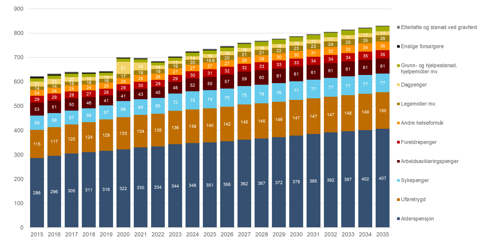
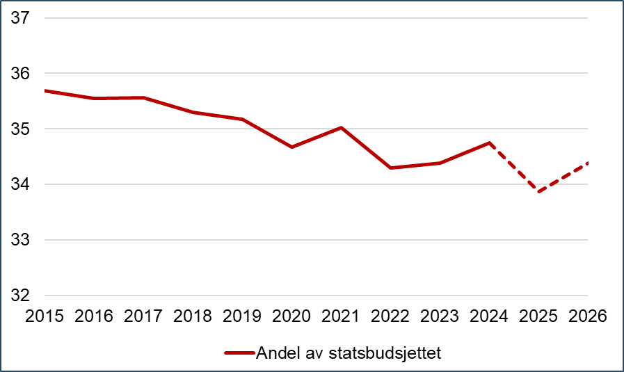

# 3. Overordnede utviklingstrekk

## 3.1 Utviklingen fra 2015 til 2025

Figur 1. Utviklingen i folketrygdens utgifter, etter stønadstype. Faktisk utvikling 2015–2025, prognose 2026–2035. Realverdi i milliarder 2026-kroner[^2]

Kilde: Nav, Helsedirektoratet.

Utgiftene til folketrygden i faste 2026-kroner (realverdi[^3]) har økt fra 623 milliarder kroner i 2015 til 736 milliarder kroner i 2025 (figur 1). Det er en økning på 113 milliarder kroner eller 18 prosent.

Figur 2. Dekomponering av utgiftsendring i folketrygden 2015–2025 og prognose for utgiftsendring 2025–2035, etter forklaringsfaktorer. Realvekst i milliarder 2026-kroner

\* Utgiftsvekst som verken kan forklares av befolkningsendringer eller regelendringer.

Kilde: Nav, Helsedirektoratet.

Vi anslår at befolkningsendringer har bidratt til 108 milliarder kroner av denne økningen. Regelendringer anslås å ha gitt en innsparing på 33 milliarder kroner. Det skyldes hovedsakelig pensjonsreformen som har gitt en innsparing på 39 milliarder kroner, mens andre regelendringer i sum trekker opp med 6 milliarder kroner. Andre forhold, som verken kan knyttes til befolkningsendringer eller regelendringer, anslås å ha gitt en vekst på 38 milliarder kroner. Det skyldes høyere pensjonsopptjening (som alene bidrar med 20 milliarder kroner), sterk vekst i uføretrygd og sykepenger (henholdsvis 8 og 6 milliarder kroner utover effekten av befolkningsvekst og regelendringer) og sterk vekst for legemidler, med 5 milliarder kroner utover effekten av befolkningsvekst og regelendringer. Utgiftene til dagpenger, enslige forsørgere, arbeidsavklaringspenger, etterlatte og andre helseformål har hatt lavere vekst enn befolkningsendringer og regelendringer tilsier, og trekker dette tallet ned.

Av enkeltordninger er det alderspensjon som har økt mest. Her har utgiftene økt med 65 milliarder kroner til 351 milliarder kroner i 2025. Veksten i alderspensjonsutgiftene forklares av sterk befolkningsvekst i eldre aldersgrupper, samt sterkt økende pensjonsopptjening blant nye pensjonister. Pensjonsreformen har bidratt til å trekke ned utgiftsveksten med 39 milliarder kroner, men andre regelendringer for alderspensjon har bidratt til 5 milliarder kroner i vekst (økt grunnpensjon til gifte/samboende pensjonister og flere økninger av minste pensjonsnivå).

Utgiftene til de helserelaterte ytelsene samlet (sykepenger, arbeidsavklaringspenger og uføretrygd) har økt fra 227 milliarder kroner i 2015 til 269 milliarder kroner i 2025. Det er en realvekst på 42 milliarder kroner. Uføretrygd har økt med 25 milliarder kroner, sykepenger med 15 milliarder og arbeidsavklaringspenger med 2 milliarder kroner.

Realveksten for de helserelaterte ytelsene er klart høyere enn hva befolkningsendringer skulle tilsi, som er en vekst på 24 milliarder kroner. Andelen av befolkningen 18–66 år som mottar helserelaterte ytelser gikk ned hvert år i perioden 2013–2019, men utviklingen snudde med koronapandemien til en økning, og økningen har senere fortsatt hvert år. Det skyldes økt andel med sykepenger og arbeidsavklaringspenger, mens andelen med uføretrygd har flatet ut. Økningen skyldes blant annet at koronapandemien førte til økt sykefravær og forsinkede avklaringer på arbeidsavklaringspenger. Den fortsatte økningen i etterkant av pandemien har trolig sammensatte årsaker, blant annet ettervirkninger av pandemien og at flere har fått sykepenger og arbeidsavklaringspenger som følge av psykiske lidelser. Videre har regelendringene i 2022 gjort det lettere å få forlenget eller innvilget en ny periode med arbeidsavklaringspenger, og pressede ressurser hos Nav til oppfølging og saksbehandling kan ha ført til forsinkelser i avklaringer.

Særlig stor økning finner vi også for legemidler og andre helseformål, det vil si folketrygdens helserefusjoner under Helse- og omsorgsdepartementet, som samlet har økt fra 38 milliarder kroner i 2015 til 47 milliarder kroner i 2025. Økte utgifter til legemidler mv. (kjøp på blå resept inkl. medisinsk forbruksmateriell) står for 5,6 milliarder kroner av økningen tilsvarende 40 prosent, mens andre helseformål har økt med 3,1 milliarder kroner (13 prosent). Økningene på området gjelder i hovedsak frikortordningen, tannbehandling og økt forbruk av legemidler. Trinnprisordningen for byttbare legemidler, innstramming i regler for fedme- og diabeteslegemidler, avvikling av diagnoselisten for fysioterapi (gratis fysioterapi) og de siste årenes innstramminger på tannhelseområdet har bidratt til å dempe utgiftsøkningene. I løpet av perioden har flere legemidler blitt overført til de regionale helseforetakene. Siden det korrigeres for oppgaveoverføringer, blir ikke realveksten i folketrygdens utgifter til legemidler direkte påvirket av dette.

Utviklingen har variert over tid. I 2015 og 2016 økte folketrygdens utgifter mer enn hva befolkningsendringene bidro med. Det skyldes hovedsakelig at utgiftsveksten for alderspensjon var særlig høy i denne perioden, ettersom pensjonsreformen førte til merutgifter i de første årene etter at reformen trådte i kraft i 2011 (se kapittel 6). I perioden 2017–2019 var det motsatt, det vil si lavere vekst enn hva befolkningsendringene tilsier. Det skyldes først og fremst reduksjon i bruken av de helserelaterte ytelsene, og at innstrammingseffektene av pensjonsreformen begynte å få større effekt. Årene 2020–2022 var sterkt påvirket av koronapandemien og realveksten i disse årene var henholdsvis 8,8 prosent, -0,4 prosent og -1,9 prosent, etterfulgt av ny høy vekst i 2023 og 2024 med henholdsvis 2,9 og 3,1 prosent. I 2025 var realveksten 1,3 prosent, som igjen var lavere enn hva befolkningsendringer skulle tilsi (1,8 prosent).

De største effektene av regelendringer fordeler seg slik, der anslått effekt på utgiftsøkningen fra 2015 til 2025 er oppgitt for hvert område:

- Alderspensjon: -34 milliarder kroner. Her gjelder -39 milliarder kroner pensjonsreformen, mens 5 milliarder kroner gjelder andre endringer, hovedsakelig økt grunnpensjon til gifte og samboende og flere økninger i minste pensjonsnivå.

- Uføretrygd: +4,3 milliarder kroner. De viktigste endringene gjelder indirekte konsekvenser av regelendringer for arbeidsavklaringspenger (+3,5 milliarder kroner, gjelder først og fremst endringer fra 2018, men også et tiltak fra koronapandemien), økte minstesatser i 2024 (+0,9 milliarder kroner) og økt grunnpensjon til gifte og samboende (+0,4 milliarder kroner). Regelendringer som trekker ned kostnadene er i hovedsak avvikling av flyktningefordel og økt botidskrav (-0,5 milliarder kroner).

- Arbeidsavklaringspenger: -4,4 milliarder kroner. De største endringene gjelder innstrammingene fra 2018 når det gjelder maksimal varighet, mulighet for unntak og innføring av karensår som utgjør -4,5 milliarder kroner, redusert minsteytelse for unge AAP-mottakere og avvikling av ung ufør-tillegget fra 2020 som utgjør -1,1 milliarder kroner, og nye regler fra 1. juli 2022, blant annet fjerning av karensåret og nye regler for unntak, som utgjør 0,7 milliarder kroner. Her understreker vi at effektene av de nevnte innstrammingene i 2018 og de nye reglene fra 1. juli 2022 kun er basert på usikre regneeksempler, og at det derfor er vanskelig å skille mellom effekter av regelendringer og andre utviklingstrekk.

- Etterlatte og stønad ved gravferd: +1,3 milliarder kroner. Dette skyldes etterlattereformen.

- Sykepenger mv.: +1,1 milliarder kroner. Av dette skyldes 0,9 milliarder kroner pleiepengereformen, mens resterende utgiftsøkning hovedsakelig skyldes økt kompensasjonsgrad for sykepenger til selvstendig næringsdrivende.

- Andre helseformål: +1,0 milliarder kroner. Dette gjelder effekten av nytt felles egenandelstak for frikort.

- Foreldrepenger: +0,9 milliarder kroner. Dette gjelder hovedsakelig økt sats for engangsstønad, innføring av selvstendig uttaksrett for foreldrepenger til fedre og utvidelse av foreldrepengeperioden ved 80 prosent dekningsgrad..

Figur 3. Utviklingen i folketrygdens utgifter[^4] som andel av statsbudsjettet (venstre panel)[^5] og fastlands-BNP (høyre panel). Prosent

Kilde: Nav, Helsedirektoratet og Finansdepartementet.

Statsbudsjettet har også vokst betydelig, og folketrygdens utgifter som andel av statsbudsjettet har derfor gått ned fra 35,7 prosent i 2015 til 33,9 prosent i 2025 (figur 3). Som andel av bruttonasjonalprodukt for fastlands-Norge (fastlands-BNP) har folketrygdutgiftene derimot økt fra 15,4 prosent i 2015 til 16,0 prosent i 2025. Andelen har svingt noe over tid, hovedsakelig i takt med konjunkturene. I 2020 og 2021 økte andelen betydelig som følge av koronapandemien. Økningen fra 2015 til 2025 kan forklares av at alderspensjonsutgiftene har økt med 0,6 prosentpoeng som andel av fastlands-BNP (figur 4). Folketrygdens utgifter utenom alderspensjon som andel av fastlands-BNP har dermed vært uendret i denne perioden.

Figur 4. Utviklingen i folketrygdens utgifter som andel av fastlands-BNP, etter stønadstype. Faktisk utvikling 2015–2025, prognose 2026–2035. Prosent

Kilde: Nav, Helsedirektoratet og Finansdepartementet.

Figur 5. Antall mottakere av de største ytelsene (ikke korrigert for at en person kan motta flere ytelser samtidig). Faktisk utvikling 2015–2025, prognose 2026–2035. Gjennomsnittstall for året i 1 000

Kilde: Nav.

Utgiftsutviklingen for de største trygdeytelsene følger i stor grad utviklingen i antall mottakere (figur 5). Samlet var det rundt 2,1 millioner mottakere[^6] av de største trygdeytelsene i 2025 (gjennomsnittstall for året, der kun ytelsene som inngår i figur 5 er medregnet). Det er en økning fra 1,8 millioner i 2014. Økningen skyldes i stor grad alderspensjon, der antall mottakere har økt med rundt 220 000 fra 2015 til 2025. I tillegg har det blitt 63 000 flere med uføretrygd, 22 000 flere med sykepenger eller pleiepenger og 21 000 flere med grunnstønad.

## 3.2 Utviklingen fra 2025 til 2035

Fram mot 2035 venter vi at utgiftene til folketrygden, gitt videreføring av dagens regelverk samt Stortingets pensjonsforlik, vil øke fra 736 milliarder kroner i 2025 til 831 milliarder kroner i 2035 (tall i 2026-kroner). Det er en økning på 95 milliarder kroner, eller 13 prosent.

Vi anslår at befolkningsendringer isolert sett vil bidra til 102 milliarder kroner i utgiftsøkning. Regelendringer anslås til å gi en innsparing på 51 milliarder kroner. Andre forhold, som verken kan knyttes til befolkningsendringer eller regelendringer, anslås til å gi en vekst på 44 milliarder kroner. Av dette gjelder:

- 24 milliarder kroner alderspensjon, og skyldes særlig effekten av økt pensjonsopptjening for nye alderspensjonister. Høyere vekst i antall utenlandsboende pensjonister enn for pensjonister i Norge inngår også her.

- Henholdsvis 4 og 6 milliarder kroner av dette gjelder legemidler og andre helseformål, og skyldes økt forbruk av legemidler og helsetjenester generelt, samt vridning mot nye og dyrere legemidler på enkelte områder.

- 8 milliarder kroner gjelder helserelaterte trygdeytelser og skyldes hovedsakelig at vi i 2026 og 2027 venter noe høyere vekst enn hva befolkningsendringer tilsier (se kapittel 4).

Blant trygdeytelsene ventes alderspensjon å stå for den største økningen fram til 2035, med en økning på 56 milliarder kroner. Pensjonsreformen bidrar til å redusere utgiftsveksten til alderspensjon vesentlig (se kapittel 6), og alderspensjonsutgiftene ventes derfor å øke med 27 milliarder kroner mindre enn hva befolkningsendringer tilsier. Omleggingen av AFP i offentlig sektor fra 2025 har medført at flere tar ut alderspensjonen tidlig (se nærmere omtale i kapittel 6) og vil trekke opp veksten noe i perioden 2025–2030.

For de helserelaterte trygdeytelsene (sykepenger, arbeidsavklaringspenger og uføretrygd) venter vi samlet en økning på 20 milliarder kroner, som tilsvarer en økning på 7 prosent. Det er 10 milliarder kroner mer enn hva befolkningsendringer tilsier. Det skyldes at vi venter fortsatt høy vekst i antall mottakere av arbeidsavklaringspenger og uføretrygd i 2026 og 2027, før utviklingen deretter i hovedsak vil følge hva befolkningsendringene tilsier til 2032. Fra 2033 vil pensjonsforliket trekke opp veksten, som følge av økt øvre aldersgrense for disse ytelsene. Betydelig vekst i bruken av pleiepenger, som inngår i budsjettkapitlet sykepenger, trekker også opp utgiftene.

Utgifter til legemidler og andre helseformål ventes å øke med henholdsvis 6 og 8 milliarder kroner, som tilsvarer en vekst på henholdsvis 33 og 29 prosent. Dette er henholdsvis 4 og 6 milliarder kroner mer enn hva befolkningsendringer tilsier. Dette skyldes økt forbruk per pasient, der allmennlegetjenester og spesialistlegetjenester bidrar mest, og nye og dyrere legemidler.

For grunn- og hjelpestønad, hjelpemidler mv. venter vi en økning på 4 milliarder kroner, som er en økning på 29 prosent. Den høye veksten skyldes først og fremst sterk vekst i antall eldre over 80 år, som er den gruppen som hyppigst bruker hjelpemidler. En trend med betydelig vekst i antall mottakere av grunnstønad og hjelpestønad, særlig blant barn og unge, trekker også opp.

De største effektene av regelendringer fordeler seg slik, der anslått effekt på utgiftsøkningen fra 2025 til 2035 er oppgitt for hvert område:

- Pensjonsreformen, inklusive pensjonsforliket, anslås å gi en utgiftsreduksjon i 2035 (sammenliknet med effektene i 2025) på 47 milliarder kroner. I tillegg vil andre regelendringer for alderspensjon samlet gi en utgiftsreduksjon på 4 milliarder kroner. Dette gjelder hovedsakelig avvikling av etterlatterettigheter og at flere økninger i minste pensjonsnivå gir gradvis avtakende virkning over tid.

- Regelendringer for uføretrygd anslås til å gi en utgiftsøkning på 1,9 milliarder kroner. De viktigste endringene er økt øvre aldersgrense som del av pensjonsforliket (+2,5 milliarder kroner), økning av fribeløpet til 1 G (+0,8 milliarder kroner) og avvikling av særskilte rettigheter for flyktninger og økt botidskrav (-1,2 milliarder kroner). Det er i tillegg en del mindre regelendringer.

- Regelendringer for stønader til enslige forsørgere anslås til å gi en utgiftsreduksjon på 1,3 milliarder kroner. Det gjelder avviklingen av overgangsstønad og øvrige stønader til enslige forsørgere med virkning for nye mottakere fra 1. juli 2026, med unntak for visse grupper.

- Regelendringer for etterlatte anslås til å gi en utgiftsreduksjon på 1,1 milliarder kroner. Det gjelder etterlattereformen, der omleggingen fra gjenlevendepensjon til en tidsbegrenset omstillingsstønad trekker ned, mens økt barnepensjon trekker opp.

Som andel av fastlands-BNP venter vi at folketrygdens utgifter vil øke vesentlig fra 16,0 prosent i 2025 til 17,3 prosent i 2035.

Det er stor usikkerhet i utgiftsanslagene på lang sikt, som følge av usikre forutsetninger om befolkningsutviklingen og tilbøyeligheten til å bruke de ulike ordningene. Forskjellen mellom folketallet i Norge i lav- og høyalternativet i befolkningsframskrivingene fra Statistisk sentralbyrå (SSB) er 10 prosent i 2035, og de ulike alternativene peker også mot vesentlige forskjeller i befolkningssammensetningen.

