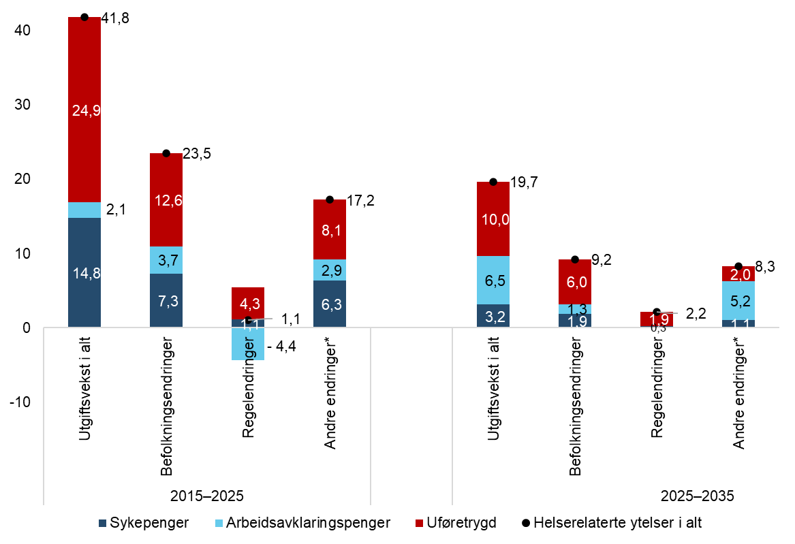

# Helserelaterte ytelser

De helserelaterte ytelsene omfatter kapittel 2650 Sykepenger, kapittel 2651 Arbeidsavklaringspenger og kapittel 2655 Uførhet.

Figur 6. Dekomponering av utgiftsendringer for helserelaterte ytelser 2015–2025 og prognose for utgiftsendringer 2025–2035, etter forklaringsfaktorer. Realvekst i milliarder 2026-kroner

\*Utgiftsvekst som verken kan forklares av befolkningsendringer eller regelendringer.

Kilde: Nav.

## Utviklingen fra 2015 til 2025

Utgiftene til de helserelaterte ytelsene har samlet sett økt med 41,8 milliarder kroner i faste 2026-kroner, fra 227,2 milliarder kroner i 2015 til 269,0 milliarder kroner i 2025. Utgiftene til sykepenger[^7] økte med 14,8 milliarder kroner, mens uføretrygd[^8] økte med 24,9 milliarder kroner. Utgiftene til arbeidsavklaringspenger[^9] økte med 2,1 milliarder kroner.

Befolkningsendringer har i denne perioden bidratt til en utgiftsvekst på 23,5 milliarder kroner for de tre kapitlene samlet[^10]. Av disse merutgiftene gjelder 7,3 milliarder kroner sykepenger, 3,7 milliarder kroner gjelder arbeidsavklaringspenger og 12,6 milliarder kroner gjelder uføretrygd.

Regelendringer har bidratt til en utgiftsøkning på i alt 1,1 milliarder kroner. På sykepengekapitlet har regelendringer gitt 1,1 milliarder kroner i merutgifter. Det er pleiepengereformen og økt kompensasjonsgrad til selvstendig næringsdrivende som har bidratt til denne utgiftsveksten.

For uføretrygd og arbeidsavklaringspenger (AAP) anslås regelendringer å ha gitt henholdsvis 4,3 milliarder kroner i merutgifter og 4,4 milliarder kroner i mindreutgifter. De største endringene er for arbeidsavklaringspenger knyttet til 2018-endringene i regler for maksimal varighet og innstramming av muligheten for unntak (-4,5 milliarder kroner), reduksjon i minsteytelsen for de under 25 år og fjerning av ung ufør-tillegget (-1,1 milliarder kroner) og endringene fra 1. juli 2022 knyttet til fjerning av karensåret, nye unntaksregler og overgangsordning (+0,7 milliarder kroner). [^11] Regelverksendringene for AAP har også påvirket utgiftene til uføretrygd. I perioden 2018–2019 har strengere vilkår for å få innvilget og forlenget unntak fra ordinær varighetsbestemmelse for AAP bidratt til merutgifter til uføretrygd, sammen med den nevnte endringen i maksimal varighet. Forlenget maksimal varighet for mottakere av AAP i forbindelse med koronapandemien, bidrar med utgiftsreduksjon for uføretrygd. Også regelverksendringene for AAP i 2022 kan ha påvirket utgiftene til uføretrygd. Effekten er imidlertid usikker og derfor ikke eksplisitt medregnet som en tiltakseffekt for uføretrygd. Andre regelverksendringer som har påvirket utgiftene er heving av grunnpensjonen for gifte/samboende for de uføretrygdede som i 2015 ble overført fra den tidligere uførepensjonsordningen, økt botidskrav og avvikling av særskilte rettigheter for flyktninger fra 2021 samt at minstesatsene ble satt opp i 2024.

Utgiftsveksten fra 2015 til 2025 har vært 17,2 milliarder kroner høyere enn befolkningsendringer og regelendringer skulle tilsi. For sykepenger skyldes dette i hovedsak økt sykefravær som isolert sett har bidratt til å øke sykepengeutgiftene med 6,3 milliarder kroner. I denne effekten inngår også at lønnsnivået blant sykmeldte kan ha endret seg. Utgiftene til AAP, utenom anslått effekt av befolkningsendringer og regelendringer, økte med 2,9 milliarder kroner fra 2015 til 2025. En økning i andelen uføre i befolkningen kombinert med en reduksjon i gjennomsnittlig ytelse har gitt en økning i utgiftene til uføretrygd, utover effekten av befolkningsendringer og regelendringer, på 8,1 milliarder kroner.

Hva forklarer utviklingen utover befolkningsendringer?

### Sykepenger
Det trygdefinansierte sykefraværet har økt vesentlig under og etter koronapandemien. Blant arbeidstakere med sykepenger har økt tilbøyelighet til å motta sykepenger bidratt til 1,2 prosent utgiftsvekst fra 2015 til 2025, og det utgjør 634 millioner kroner. For selvstendig næringsdrivende gikk sykepengeutgiftene ned med 332 millioner kroner i perioden 2015–2025. Nedgangen skyldes i hovedsak en lavere tilbøyelighet til å motta sykepenger blant selvstendige.

Utgiftene til pleiepenger har økt kraftig, særlig i årene etter pandemien. Fra 2015 til 2025 har utgiftene til pleie-, omsorgs- og opplæringspenger økt med 3,3 milliarder 2026-kroner (nær 450 prosent). Kun 0,4 milliarder kroner av denne veksten kan forklares av befolkningsendringer. Den viktigste forklaringen på den sterke utgiftsveksten er at pleiepengeordningen ble utvidet i 2017 og 2018. Utvidelsen medførte en langt sterkere vekst i ordningen enn forventet.

Årsakene til veksten i sykepengeutgiftene er mange og sammensatte. Årsstatistikk for det legemeldte sykefraværet viser en økning fra 4,8 prosent i 2019 til 5,8 prosent i 2024, som innebærer en prosentvis vekst på 21 prosent. Nivået i 2015 var til sammenlikning 4,8 prosent. Tallene for 2025 er påvirket av restansenedbygging, som blant annet har gitt høyere utgifter i 4. kvartal enn utviklingen i antall sykepengemottakere skulle tilsi.

[Delalic og Lunde (2025)](https://www.nav.no/no/nav-og-samfunn/kunnskap/analyser-fra-nav/arbeid-og-velferd/arbeid-og-velferd/arbeid-og-velferd-nr.3-2025/stadig-flere-blir-sykemeldt-med-en-psykisk-lidelse.hvem-er-de) peker på at pandemien og samfunnsendringene etter pandemien har rammet bredt, og at dette er én årsak til økningen i sykefraværet. Kalstø og Delalic (2026) viser til at vi i tiden under og etter pandemien både har sett økt sykefravær, at flere startet å motta sykepenger og at flere har brukt opp sykepengerettighetene sine. Sannsynligvis påvirkes både sykefraværet og bruken av pleiepengeordningen av et samspill mellom flere faktorer, deriblant sykdomsbildet i befolkningen, forhold på arbeidsplassen og skolen, økonomiske forhold, holdninger til sykefravær, utviklingen på arbeidsmarkedet, regelverksendringer, behandlingskapasitet i helsevesenet m.m. Vi ser imidlertid nå tegn til at utviklingen kan være i ferd med å snu. I sykefraværsstatistikken for 4. kvartal 2024 så vi for første gang på flere år en nedgang i kvartalstallene for det legemeldte fraværet, og denne utviklingen fortsatte i hele 2025. Sykefraværet i 2025 endte på 6,6 prosent. Dette er en nedgang på 2,7 prosent fra 2024.

[Nossen og Delalic (2024)](https://www.nav.no/no/nav-og-samfunn/kunnskap/analyser-fra-nav/arbeid-og-velferd/arbeid-og-velferd/arbeid-og-velferd-nr.2-24/hvorfor-er-sykefravaeret-fortsatt-hoyt-34-ar-etter-starten-av-pandemien) har sett nærmere på utviklingen, og forklarer det høye fraværet og den ytterligere økningen etter pandemien først og fremst med mange lange sykefravær, selv om de korte sykefraværene har økt mye i antall. Brytes tallene ned på kjønn, alder, yrke og næring, ser vi dessuten at sykefraværet har økt i alle grupper. Økningen er størst for aldersgruppene under 40 år, blant håndverkere og blant ansatte innen bygg og anlegg. Ifølge [Nossen og Delalic (2024)](https://arbeidogvelferd.nav.no/article/2024/06/Hvorfor-er-sykefrav%C3%A6ret-fortsatt-h%C3%B8yt-3%E2%80%934-%C3%A5r-etter-starten-av-pandemien) må økningen ses i sammenheng med lavere aktivitet i bransjen, som følge av økt kostnads- og rentenivå de siste årene. Det trekkes også fram at 43 prosent av økningen i sykefraværet fra fjerde kvartal 2019 til fjerde kvartal 2023 kunne tilskrives psykiske lidelser; først og fremst diagnoser som klassifiseres som psykiske symptomer/plager og i mindre grad sykdomsdiagnoser som depresjon og angst. Luftveislidelser og enkeltdiagnosen «slapphet/tretthet», som kan knyttes til henholdsvis covid-19 og senfølger av covid-19 («long covid»), stod også for mye av økningen, henholdsvis 33 prosent og 15 prosent.

[Delalic og Lunde (2025)](https://www.nav.no/no/nav-og-samfunn/kunnskap/analyser-fra-nav/arbeid-og-velferd/arbeid-og-velferd/arbeid-og-velferd-nr.3-2025/stadig-flere-blir-sykemeldt-med-en-psykisk-lidelse.hvem-er-de) har fokusert på det sykefraværet som skyldes psykiske diagnoser. De finner at det i perioden 2018 til 2023 var en økning i antallet sykmeldte med slike diagnoser på 28 prosent, mens antallet sykmeldte med andre diagnoser (unntatt luftveislidelser) økte med 5 prosent i samme periode. For gruppen med psykiske lidelser finner de ingen endring i antallet sykefravær per person, men gjennomsnittlig varighet økte fra 68 dager i 2018 til 74 dager i 2023. Denne veksten skyldes at det er de lange fraværene som er blitt lengre enn tidligere.

I debatten om sykefravær pekes det ofte på psykiske diagnoser og psykisk helse blant unge. Ifølge Delalic og Lunde er det en utbredt misforståelse at de yngste utgjør en vesentlig større andel av de sykmeldte med psykiske diagnoser. Psykiske diagnoser har tradisjonelt utgjort en større andel av de unges sykefravær, men dette har sammenheng med at unge har en lavere risiko for ulike somatiske sykdommer. Delalic og Lunde finner likevel at sykefravær med psykiske diagnoser har økt fra 2018 til 2023, men økningen gjelder for hele befolkningen.

### Arbeidsavklaringspenger
Befolkningsendringer skulle tilsi en økning i antall mottakere av arbeidsavklaringspenger på om lag 11 000 fra 2015 til 2025, mens antall mottakere faktisk har økt med om lag 14 000. Regelendringer skulle ut fra usikre anslag tilsi en nedgang i antall mottakere, og endringer i tilbøyeligheten til å motta AAP må dermed ha bidratt til økning i antall mottakere. Vi klarer imidlertid ikke å skille effekten av regelendringer og endringer i tilbøyeligheten til å motta AAP. Gjennomsnittlig utbetaling per mottaker har også gått ned, målt i faste 2026-kroner. Reduksjon i minsteytelsen for de under 25 år og fjerning av ung ufør-tillegget vil være en viktig forklaringsfaktor her.

AAP ble innført mars 2010 som erstatning for tidsbegrenset uførestønad, rehabiliteringspenger og attføringspenger. Etter en økning i antall mottakere i 2010 og 2011, var antallet synkende fram til 2020. Nedgangen var spesielt stor i 2014 og 2018. I 2014 må nedgangen ses i sammenheng med at en del av dem som ble overført til AAP fra de tre tidligere ordningene, nådde den generelle maksimale varigheten på arbeidsavklaringspenger ved utgangen av februar 2014. Mange av disse gikk over til uføretrygd. Den store nedgangen i 2018 skyldes i hovedsak at flere gikk ut av ordningen, i hovedsak som følge av innstrammingen av vilkårene for unntak fra den generelle, maksimale varigheten og innføringen av et karensår før rett til en ny periode med AAP. Det ble også satt inn ekstra ressurser i Nav til førstegangsbehandling av uføresaker, som førte til at særlig mange gikk over på uføretrygd i 2018. I tillegg var antallet som kom inn på AAP i 2018, lavt.

I årene 2020–2025 økte antall mottakere av AAP. Avgangen fra AAP ble betydelig redusert under koronapandemien, som følge av at avklaringsarbeidet ble vanskeligere, midlertidige endringer i maksimal varighet og et svakere arbeidsmarked. Etter at pandemien var over og arbeidsmarkedet var bedre, har avgangen fortsatt å være relativt lav, noe vi blant annet setter i sammenheng med ettervirkninger av pandemien (forsinkelser i avklaringsløpene), samt samspillseffekter mellom disse og regelverksendringene fra 1. juli 2022 (nye regler for unntak, fjerning av karensår, samt overgangsordning med forlengelse av maksimal varighet til utgangen av oktober 2022). Pressede ressurser når det gjelder oppfølging og saksbehandling kan også være med å forklare utviklingen. Mer spesifikt viser Navs årlige surveyundersøkelse blant veiledere ved Nav-kontor, der veilederne blir spurt om hvor mange de har ansvar for å følge opp, at porteføljestørrelsen for statlig ansatte veiledere (som er mest relevant for AAP) i årene 2022–2025 var henholdsvis 78, 87, 89 og 91. Disse tallene gjelder alle innsatsgrupper, og altså ikke kun de med nedsatt arbeidsevne. Tilsvarende tall for veiledere som ikke er ungdomsveiledere, var i årene 2022–2025 henholdsvis 84, 96, 102 og 106. Blant ungdomsveiledere (de som hovedsakelig følger opp unge under 30 år) ligger porteføljestørrelsen nokså stabilt rundt 58 (henholdsvis 57, 62, 58 og 58). Veksten i gjennomsnittlig porteføljestørrelse er altså knyttet til veiledere som ikke er ungdomsveiledere.

I 2024 og til dels i 2025 tok imidlertid avgangen seg opp, men da var til gjengjeld tilgangen spesielt høy slik at antall mottakere økte mye i 2024 og 2025 også. I de siste årene har rundt halvparten av de med avgang gått til uføretrygd, inkludert de som kombinerer uføretrygd og arbeid, mens rundt 20 prosent har gått til kun arbeid. Resten av de som har gått i avgang, kan for eksempel motta arbeidsavklaringspenger igjen, motta tiltakspenger, alderspensjon eller sosialhjelp, være ordinær arbeidssøker, privat forsørget eller under utdanning. Andelene har variert noe over tid. I årene 2020–2025 var også tilgangen til arbeidsavklaringspenger høyere enn tidligere. Dette gjelder, som nevnt, særlig 2024 og 2025. Den høyere tilgangen må ses i sammenheng med høyere tilgang fra sykepenger. [Kalstø og Delalic (2026)](https://www.nav.no/no/nav-og-samfunn/kunnskap/analyser-fra-nav/notatserie/flere-mottar-helserelaterte-ytelser-etter-pandemien) ser på perioden 2019-2024 og finner at pandemien førte til at flere nådde makstid sykepenger etter 2019 og dermed startet å motta AAP. De finner videre at også en større andel av de som nådde makstid sykepenger, har gått over på AAP.

### Uføretrygd
Utgiftene til uføretrygd økte klart mer enn hva befolkningsutviklingen skulle tilsi i perioden 2015–2025. Dette skyldes i hovedsak de omtalte endringene i regelverket for varighet i AAP-ordningen i 2018, som ga særskilt stor vekst i 2018 og 2019. Erfaringene fra de siste årene er at mange har kommet tidligere over på uføretrygd ved mottak av AAP enn de ville gjort ved mottak av de tidligere ytelsene (rehabiliteringspenger, attføringspenger og tidsbegrenset uførestønad). På den andre siden har det vært en betydelig nedgang i andelen uføre i eldre aldersgrupper de senere årene, noe som har dempet utgiftsveksten. Uførereformen fra 2015 er anslått å være tilnærmet budsjettnøytral, når det korrigeres for at økningen i gjennomsnittlig uføretrygd motsvares av om lag tilsvarende høyere skatteinngang som følge av endringer i skattereglene. Avgangen fra uføretrygd skyldes i hovedsak overgang til alderspensjon ved 67 år. I perioden 2020–2024 har andelen av de som har avgang som går til alderspensjon, vært rundt 72 prosent.[^12] Det er også en andel av de som slutter å motta uføretrygd, som skyldes dødsfall. I perioden 2020–2023 var denne andelen 12 prosent. Den resterende andelen gjelder hovedsakelig personer som går midlertidig eller permanent ut av uføretrygd på grunn av for høy arbeidsinntekt.

### Unge med helserelaterte trygdeytelser
Andelen som mottar helserelaterte ytelser i aldersgruppen under 30 år, økte noe i årene før koronapandemien, med en andel på 6,7 prosent i 2013 og 7,1 prosent i 2019, og har deretter økt vesentlig, til 8,6 prosent i 2024. Økningen gjelder særlig uføretrygd, der andelen har økt fra 1,3 prosent i 2013 til 2,7 prosent i 2024. For arbeidsavklaringspenger har andelen økt fra 3,4 prosent i 2013 til 3,7 prosent i 2024, mens den for sykepenger har gått opp fra 2,1 prosent til 2,3 prosent. Økningen for uføretrygd skyldes trolig dels en vridningseffekt der unge tidligere enn før går over fra arbeidsavklaringspenger til uføretrygd. I tillegg skyldes det i stor grad at flere enn før blir uføretrygdet når de er 18–19 år. En mulig forklaring til denne veksten kan være at flere blir født med funksjonshemminger og dels at flere tidlig fødte barn overlever med nevrologiske og psykiske senskader ([Nossen 2025](https://data.nav.no/fortelling/omverdensanalysen2025/kapitler/ferdig_versjon/kap10.html#%C3%B8kt-andel-p%C3%A5-helserelaterte-ytelser-blant-dem-under-30-%C3%A5r)).

## Utviklingen fra 2025 til 2035

Utgiftene til de helserelaterte ytelsene ventes å øke med 19,7 milliarder kroner fra 2025 til 2035, til 288,7 milliarder kroner (2026-kroner). Utgiftene til sykepenger (inkl. pleie-, omsorgs- og opplæringspenger) ventes å øke med 3,2 milliarder kroner i løpet av perioden, mens utgiftene til arbeidsavklaringspenger og uføretrygd antas å øke med henholdsvis 6,5 og 10,0 milliarder kroner.

Befolkningsendringer ventes isolert sett å trekke opp utgiftene med 9,2 milliarder kroner. Det innebærer at utgiftene til helserelaterte ytelser anslås å øke 10,5 milliarder kroner mer enn hva befolkningsendringer tilsier. Dette beløpet gjelder arbeidsavklaringspenger (+5,2), sykepenger (+1,3) og uføretrygd (+3,9).

Regelendringer ventes å bidra til en samlet utgiftsvekst på 2,2 milliarder kroner. Av dette gjelder 0,3 milliarder kroner sykepenger og skyldes at pensjonsforliket gir økt øvre aldersgrense for sykepenger og pleiepenger. Regelendringer for AAP bidrar i sum til en utgiftsvirkning på 0,0 milliarder kroner. Dette gjelder utfasing av en koronaregel fra mars 2020 og innføring av ny ungdomsprogramytelse (-0,2 milliarder kroner) og pensjonsforliket med økt øvre aldersgrense for AAP (+0,2 milliarder kroner).

For uføretrygd er det en utgiftsvirkning av regelendringer på 1,9 milliarder kroner fram mot 2035. Det største bidraget til veksten oppstår i slutten av perioden (2033–2035), og er knyttet til pensjons­forliket. Dette skyldes økt aldersgrense for overgang fra uføretrygd til alderspensjon. Andre regelendringer som påvirker uføretrygd, er mindre i omfang og inntreffer tidligere. Dette gjelder blant annet økte minstesatser, økt botidskrav, avviklingen av særskilte rettigheter for flyktninger og avviklingen av etterlatterettigheter for uføre.

Andre forhold, det vil si endringer i tilbøyeligheten til å motta disse ytelsene og endringer i gjennomsnittlig ytelse per mottaker, antas dermed å gi en utgiftsvekst på 8,3 milliarder kroner fra 2025 til 2035. For sykepenger ventes det en utgiftsvekst utover effekten av befolkningsendringer og regelendringer på 1,1 milliarder kroner. Effekten skyldes hovedsakelig en fortsatt vekst i antallet mottakere av pleiepenger. Det er lagt til grunn 23 prosent vekst i antall mottakere fram til 2035, og at veksten hovedsakelig vil komme fram til 2030.

For arbeidsavklaringspenger venter vi en utgiftsvekst fra 2025 til 2035 utover effekten av befolkningsendringer og regelendringer på 5,2 milliarder kroner. Antall mottakere av arbeidsavklaringspenger økte gjennom 2025. Vi venter økning både i 2026 og i 2027. Vi legger til grunn at økningen blant annet har sammenheng med ettervirkninger av pandemien (forsinkelser i avklaringsløpene) og samspillseffekter mellom disse og regelverksendringene fra 1. juli 2022 (nye regler for unntak, fjerning av karensår, samt overgangsordning med forlengelse av maksimal varighet til utgangen av oktober 2022). Pressede ressurser når det gjelder oppfølging og saksbehandling kan også spille inn. I tillegg har tilgangen vært høy i 2025, og vi legger til grunn høy tilgang i 2026 og 2027 også. Fra og med 2028 legges det til grunn at bruken av ordningen holder seg konstant framover i ettårige aldersgrupper, korrigert for effekter av regelendringer. Framskrivingene er svært usikre, og dersom opphopningen av mottakere på AAP under og etter koronapandemien senere blir helt eller delvis reversert, kan det medføre lavere utgifter til AAP i 2035 enn forutsatt (men til gjengjeld kan da utgiftene til uføretrygd bli noe høyere).

For uføretrygd anslår vi at utgiftene i perioden 2025 til 2035 vil øke med 2,0 milliarder kroner utover effekten av befolkningsendringer og regelendringer. Økningen skyldes i hovedsak at vi forventer en større vekst i antall mottakere av uføretrygd enn det befolkningsendringene tilsier.

