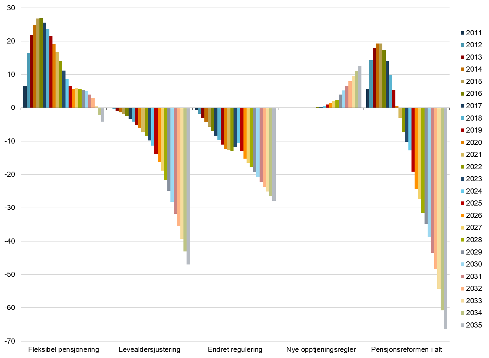

# 2. Utgiftsvirkning av pensjonsreformen

Figur 11. Årlig utgiftsvirkning av pensjonsreformen. Milliarder 2026-kroner

Kilde: Nav.

I figur 11 anslås årlige mer- og mindreutgifter til alderspensjon sammenliknet med om pensjonsreformen ikke hadde blitt gjennomført. Effektene av pensjonsforliket for alderspensjon er inkludert i beregningen, men det nye slitertillegget inngår likevel ikke her. Det er store samspillseffekter mellom de ulike komponentene av pensjonsreformen som gjør det krevende å anslå effekten av hver komponent separat. Anslagene er beregnet i en mikrosimuleringsmodell, der de ulike komponentene er tatt sekvensielt ut av reformframskrivingen i samme rekkefølge som angitt i figuren. Rekkefølgen for beregning av de ulike komponentene vil ha betydning for de beregnede effektene.

I figuren er det brukt følgende begreper:

- *Fleksibel pensjon* er de samlede endringer i utgifter knyttet til at den enkelte selv kan velge når pensjonen skal tas ut mellom nedre og øvre pensjonsalder, i dag 62 og 75 år. Dette inkluderer følgende effekter:

  - Merutgiftene til personer som tar ut pensjonen før den gamle aldersgrensen på 67 år, og de senere innsparingene etter 67 år ved at denne gruppen får livsvarig lavere alderspensjon.

  - Innsparinger som følge av at enkelte utsetter pensjonsuttaket til etter den gamle aldersgrensen på 67 år og senere merutgifter som følge av at denne gruppen får livsvarig høyere alderspensjon.

<!-- -->

- *Levealdersjustering* innebærer at alderspensjonen blir justert ut fra forventet levealder for hvert årskull. Effekten angir innsparingen som følge av levealdersjusteringen forutsatt uttak av alderspensjon ved 67 år. Skjermingstillegget er inkludert her. Dette er et tillegg som delvis skjermer uføres alderspensjon etter gammel opptjeningsmodell mot levealdersjusteringen.

- *Endret regulering* er innsparing som følge av at pensjoner under utbetaling reguleres lavere enn lønnsveksten. Effekten av den ekstraordinære reguleringen i 2021 inngår i denne komponenten og bidrar til å redusere innsparingen noe (se også figur 13).

- *Nye opptjeningsregler* angir effekten av opptjeningsreglene som innføres gradvis for årskullene 1954–1962 og fullt ut fra og med 1963-årskullet.[^17]

Utgiftene til pensjonister under 67 år økte kraftig de første årene etter pensjonsreformen i 2011. Anledningen til å gå av før 67 år fikk da en umiddelbar effekt for fem årskull, mens innsparingselementene i reformen får gradvis økende effekt. Utgiftsveksten knyttet til alderspensjonister under 67 år har avtatt etter 2016. Det skyldes at de fleksible uttaksreglene da var fullt innfaset og har også sammenheng med utfasingen av gammel AFP i privat sektor. Personer som mottok AFP etter gammelt regelverk, kunne ikke samtidig motta alderspensjon. Utgiftene til tidliguttak må ses i sammenheng med at årlig pensjon blir lavere. Dette innebærer at de samlede utgiftene på lengre sikt vil bli lavere enn om flere hadde startet uttaket på et senere tidspunkt.

De samlede merutgiftene som følge av pensjonsreformen økte fram mot 2015, for deretter å avta. Det skyldes at innsparingselementene (levealdersjustering og endret regulering) får stadig økende betydning.

2021 var det første året hvor pensjonsreformen er anslått å ha medført en reduksjon i utgiftene til alderspensjon, og innsparingseffektene økte videre i årene etter 2021. Den samlede effekten av fleksibel pensjonsalder, levealdersjustering og endret regulering anslås å ha redusert utgiftene i 2025 med nærmere 19 milliarder kroner.

For 2035 er utgiftene til alderspensjon anslått til 407 milliarder koner (i 2026-kroner). Uten pensjonsreformen anslås utgiftene i 2035 til 472 milliarder kroner. Framskrivningene tilsier dermed at utgiftene til alderspensjon i 2035 blir 65 milliarder kroner (14 prosent) lavere enn uten pensjonsreformen. Dette vil være nettoeffekten i 2035 av de ulike elementene i figur 11. Levealdersjusteringen utgjør 47 milliarder kroner i forventet innsparing i 2035. På sikt er levealdersjustering det klart viktigste innstrammingstiltaket i pensjonsreformen. Reformeffektene vil tilta i årene etter 2030. I 2040 anslås pensjonsutgiftene til å bli 91 milliarder kroner lavere enn uten reformen. Aldringen av befolkningen medfører likevel at pensjonsutgiftene fortsatt vil øke kraftig de neste tiårene. Det er også betydelig usikkerhet knyttet til reformeffektene. For eksempel vil innsparingene som følge av levealdersjusteringen bli lavere dersom levealderen øker mindre enn ventet, og effektene av endrede reguleringsregler vil bli lavere dersom årlig reallønnsvekst blir lavere enn antatt.

Omleggingen av avtalefestet pensjon (AFP) i privat sektor fra 2011 bidro til merutgifter til alderspensjon de første årene. Det skyldes at ny AFP må tas ut i kombinasjon med alderspensjon, og at de aller fleste med rett til privat AFP derfor tar ut alderspensjon fra folketrygden før fylte 67 år. I den gamle AFP-ordningen gikk mottakerne over på alderspensjon fra 67 år. AFP i offentlig sektor fikk en tilsvarende reform fra 2025, gjeldende fra og med 1963-kullet. Ny offentlig AFP ventes å medføre økt utgiftsvekst til alderspensjon i en femårsperiode fra 2025. Økningen i utgifter til alderspensjon i denne perioden vil samtidig delvis motsvares av reduserte utgifter til offentlig AFP. Samtidig vil tidliguttak gi lavere årlig alderspensjon og dermed redusere utgiftene på sikt.

Tidligere mottakere av uføretrygd i årskullene 1944–1953 får et tillegg i alderspensjonen som skjermer denne gruppen for halvparten av effekten av levealdersjusteringen. Skjermingstillegget har fra 2025 blitt videreført for årskullene 1954–1962, med samme sats som for 1953-kullet, for den del av alderspensjonen som gjelder gammel opptjeningsmodell, og følger av *Pensjonsforliket.* De årlige merutgiftene som følge av skjermingstillegget vil nå toppen i 2029, med merutgifter på 1,2 milliard kroner.

