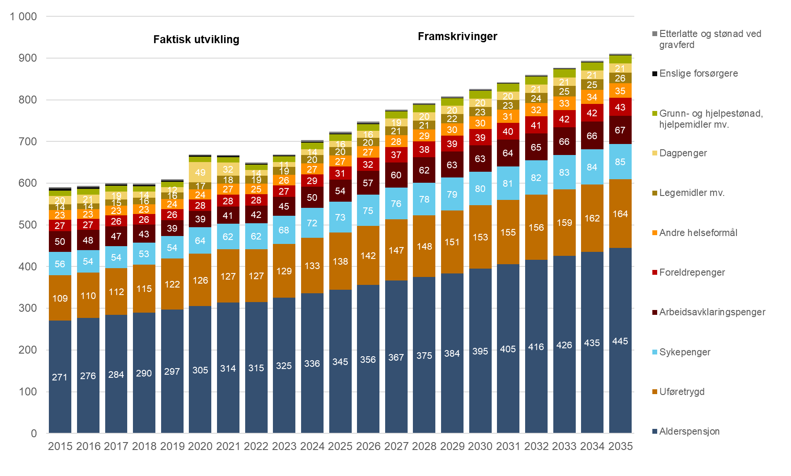

# Utgiftsvirkninger av andre politiske tiltak

Det har i perioden etter 2011 også vært ulike regelendringer for alderspensjon som ikke kan knyttes til pensjonsreformen. De viktigste er vist i figur 13.

Merutgiftene i forbindelse med økt grunnpensjon til gifte og samboende, innført i 2016, og flere økninger av minste pensjonsnivå, inkludert økning med 6 000 kroner for enslige fra 1. mai 2025, i perioden 2016–2025 utgjør maksimalt henholdsvis 3,2 milliarder kroner (i 2021) og 2,5 milliarder kroner (i 2026). Disse endringene gjelder bare alderspensjonister etter gamle opptjeningsregler, og merutgiftene vil bli gradvis redusert over tid.

Den særskilte reguleringen i 2021, som medførte at alderspensjon ble regulert med lønnsvekst, er anslått å ha gitt merutgifter i 2022 på 2,4 milliarder kroner. Den årlige merkostnaden vil har etter 2022 avtatt gradvis ettersom de som var alderspensjonister i 2021 har falt fra. Siden den særskilte reguleringen i 2021 også fikk effekt for garantipensjonssatsene i ny opptjeningsmodell, vil endringen likevel medføre varige merutgifter. Denne regelendringen er riktignok også medregnet i figur 11, da den kan ses på som en midlertidig reversering av reguleringsreglene innført med pensjonsreformen.

Effekten av at reglene for regulering av alderspensjon ble endret fra 2022 til regulering med gjennomsnittet av pris- og lønnsvekst inngår ikke i figur 13. Siden vi nå forutsetter en langsiktig, årlig reallønnsvekst på 1,0 prosent, tilsvarende hva som er anslått i [Perspektivmeldingen (2024)](https://www.regjeringen.no/no/dokumenter/meld.-st.-31-20232024/id3049290/), vil endringen i reguleringsreglene medføre merutgifter. Endret forutsetning for reallønnsvekst innebærer at utgiftsanslaget i 2035 øker med 6 milliarder kroner (+1,4 prosent) I praksis vil likevel den årlige effekten av denne endringen variere mellom merutgifter og innsparinger avhengig av variasjoner i reallønnsveksten.

Fra 2024 er etterlatteytelsene reformert. For gjenlevende ektefeller under 67 år er ordningen lagt om fra en varig etterlattepensjon til en omstillingsstønad, mens barnepensjonen til barn som har mistet én eller begge foreldrene er satt vesentlig opp sammenliknet med nivået som gjaldt til og med 2023. For alderspensjon innebærer reformen at etterlatterettigheter i gammel opptjeningsmodell blir nominelt videreført. Nominell videreføring innebærer at den delen av alderspensjonen som følger av etterlatterettigheter vil bli unntatt fra årlig regulering. Det midlertidige gjenlevendetillegget for årskullene 1954–1957, til gjenlevende som startet uttaket av alderspensjon innen utgangen av 2019, blir avviklet. Dette vil skje ved at tillegget holdes nominelt uendret og reduseres med økninger i egen alderspensjon som følge av den årlige reguleringen. Tillegget vil da bli gradvis lavere for hvert år, og til slutt bortfalle.

Figur 13. Årlig utgiftsvirkning av ulike politiske tiltak for alderspensjon. Milliarder 2026-kroner

Kilde: Nav.

Folketrygdloven hadde tidligere særskilte bestemmelser som innebar at flyktninger var unntatt fra lovens ordinære vilkår om botid. Disse ble avviklet fra 1. januar 2021, og folketrygdens botidskrav for rett til alderspensjon mv. ble hevet fra tre til fem år fra samme tidspunkt. Avviklingen av flyktningerettighetene og utvidet botidskrav vil gi en innsparing på noen titalls millioner kroner de første årene. Effektene av disse endringene vil fases inn over flere tiår. Reduserte utgifter under folketrygden motvirkes delvis av økte utgifter til supplerende stønad utenfor folketrygden. De økonomiske effektene av disse endringene er svært usikre, og avhenger av tilstrømmingen av flyktninger framover, og inngår ikke i figur 13.

Utover tiltakene nevnt over, de som inngår i figur 13, er det også gjennomført enkelte andre endringer med klart mindre økonomiske effekter enn de som inngår i figuren. Det gjelder det midlertidige gjenlevendetillegget for årskullene 1954–1957 innført i 2016. Utgiftene til dette tillegget var på 4 millioner kroner i 2025, og utgiftene vil være lavere i 2026 og årene framover som følge av tillegget holdes nominelt uendret og reduseres med økningen i egen alderspensjon som følge av den årlige reguleringen. Videre ble forsørgingstillegg (ektefelletillegg og barnetillegg) utfaset for alle mottakere over årene 2022–2025. Fra 2025 ble det ikke lenger bli utbetalt forsørgingstillegg til alderspensjonen. Innsparingen er anslått til 80 millioner kroner i 2025.

Referanser

Delalic, Lamija og Tobias Lunde (2025) «Stadig flere blir sykemeldt med en psykisk lidelse. Hvem er de?». *Arbeid og velferd*, 3-2025. Oslo: Arbeids- og velferdsdirektoratet. Tilgjengelig fra: <https://arbeidogvelferd.nav.no/article/2025/11/Stadig-flere-blir-sykmeldt-med-en-psykisk-diagnose-hvem-er-de->

Kalstø, Åshild Male og Lamija Delalic (2026): «Flere mottar helserelaterte ytelser etter pandemien». Nav-notat, 1-2026. Oslo: Arbeids- og velferdsdirektoratet. Tilgjengelig fra:

<https://www.nav.no/no/nav-og-samfunn/kunnskap/analyser-fra-nav/notatserie/flere-mottar-helserelaterte-ytelser-etter-pandemien>

Meld. St. 6 (2023–2024) *Et forbedret pensjonssystem med styrket sosial profil.* Oslo: Arbeids- og inkluderingsdepartementet. Tilgjengelig fra: [Meld. St. 6 (2023–2024) - regjeringen.no](https://www.regjeringen.no/no/dokumenter/meld.-st.-6-20232024/id3018556/)

Meld. St. 31 (2023–2024) *Perspektivmeldingen 2024*. Oslo: Finansdepartementet. Tilgjengelig fra: <https://www.regjeringen.no/no/dokumenter/meld.-st.-31-20232024/id3049290/>

Nav (2025) *Utviklingstrekk i folketrygden 2013–2033*. Nav-rapport, 1/2025. Oslo: Arbeids- og velferdsdirektoratet. Tilgjengelig fra:

<https://www.nav.no/no/nav-og-samfunn/kunnskap/analyser-fra-nav/nav-rapportserie/utviklingstrekk-i-folketrygden-20132033>

Nossen, Jon Petter (2025) «Kapittel 10 Helse», *Navs omverdensanalyse 2025–2035*. Tilgjengelig fra: <https://data.nav.no/fortelling/omverdensanalysen2025/kapitler/ferdig_versjon/kap10.html>

Nossen, Jon Petter og Lamija Delalic (2024) «Hvorfor er sykefraværet fortsatt høyt 3–4 år etter starten av pandemien?», *Arbeid og velferd*, 2-2024. Tilgjengelig fra: <https://www.nav.no/no/nav-og-samfunn/kunnskap/analyser-fra-nav/arbeid-og-velferd/arbeid-og-velferd/arbeid-og-velferd-nr.2-24/hvorfor-er-sykefravaeret-fortsatt-hoyt-34-ar-etter-starten-av-pandemien>

Prop. 1 S (2025–2026) *For budsjettåret 2026. Statsbudsjettet*. Oslo: Finansdepartementet. Tilgjengelig fra: <https://www.regjeringen.no/contentassets/556126ccb14c4c8b85d15b952bab0f4a/no/pdfs/prp202520260001guldddpdfs.pdf>

Vedlegg: Utviklingen i folketrygdens utgifter deflatert med konsumprisindeksen (KPI)

Figur 14. Utviklingen i folketrygdens utgifter, etter stønadstype. Faktisk utvikling 2015–2025, prognose 2026–2035. Milliarder 2026-kroner, deflatert med konsumprisindeksen (KPI)

Kilde: Nav, Helsedirektoratet.

I rapporten for øvrig er det ved beregning av folketrygdens utgifter i 2026-kroner brukt ulike deflatorer for ulike stønadsområder. Det gjør sammenlikning av utviklingen på tvers av områdene vanskelig. Vi viser her derfor en alternativ framstilling der konsumprisindeksen (KPI) er brukt gjennomgående som deflator (figur 14). Tabell 2 viser en sammenlikning av årlig realvekst (beregnet som i rapporten for øvrig) med vekst i faste priser.

Tolkningen av tallene i figur 14 kan være at de viser folketrygdens utgifter målt ved den kjøpekraften utgiftene kunne gitt ved en alternativ anvendelse. Denne regnemåten gir en sterkere økning i utgiftene. Folketrygdens utgifter i 2026-kroner har her økt fra 590 milliarder kroner i 2015 til 724 milliarder kroner i 2025. Fram mot 2035 ventes utgiftene å øke til 911 milliarder kroner. Det tilsvarer en gjennomsnittlig årlig økning deflatert med konsumprisindeksen på 2,1 prosent i perioden 2015–2025 og 2,3 prosent i perioden 2025–2035. Med definisjonen av realvekst brukt ellers i rapporten, er gjennomsnittlig årlig vekst i 2015–2025 og 2025–2035 på henholdsvis 1,7 og 1,2 prosent.

Over 90 prosent av folketrygdens utgifter gjelder ytelser der realveksten ellers i rapporten er beregnet ut fra deflatering med grunnbeløpet eller lønnsvekst. Dette gjelder alderspensjon, uføretrygd, sykepenger, arbeidsavklaringspenger, foreldrepenger, dagpenger og etterlatte. Veksten i grunnbeløpet og lønnsveksten har i gjennomsnitt har vært høyere enn prisvekst, noe som også forventes framover. Det er forklaringen på at utgiftsveksten deflatert med konsumprisindeksen blir klart høyere enn realveksten slik den er beregnet ellers i rapporten.

Tabell 2. Gjennomsnittlig årlig realvekst og vekst deflatert med konsumprisindeksen (KPI) 2015–2025 og 2025–2035. Prosent

| Stønadstype                              | 2015–2025     |                         | 2025–2035     |                         |
|------------------------------------------|---------------|-------------------------|---------------|-------------------------|
|                                          | **Realvekst** | **KPI-deflatert vekst** | **Realvekst** | **KPI-deflatert vekst** |
|                                          |               |                         |               |                         |
| Alderspensjon                            | 2,1           | 2,4                     | 1,5           | 2,6                     |
| Uføretrygd                               | 2,0           | 2,4                     | 0,7           | 1,8                     |
| Sykepenger                               | 2,2           | 2,7                     | 0,4           | 1,5                     |
| Arbeidsavklaringspenger                  | 0,4           | 0,8                     | 1,1           | 2,2                     |
| Foreldrepenger                           | 0,7           | 1,1                     | 1,2           | 3,5                     |
| Andre helseformål                        | 1,2           | 1,5                     | 2,6           | 2,7                     |
| Legemidler mv.                           | 3,4           | 3,4                     | 2,9           | 2,9                     |
| Dagpenger                                | -2,5          | -2,1                    | 0,4           | 3,0                     |
| Grunn- og hjelpestønad, hjelpemidler mv. | 1,9           | 1,9                     | 2,6           | 2,6                     |
| Enslige forsørgere                       | -7,9          | -7,5                    | -8,1          | -7,1                    |
| Etterlatte og stønad ved gravferd        | 1,4           | 1,8                     | -5,1          | -4,1                    |
| **Folketrygden i alt**                   | **1,7**       | **2,1**                 | **1,2**       | **2,3**                 |

Kilde: Nav, Helsedirektoratet.

[^1]: Realverdien av folketrygdens utgifter er beregnet ved hjelp av ulike deflatorer for de ulike ytelsene, se faktaboksen i kapittel 2 for en oversikt.

[^2]: Utgiftene til legemidler mv. inkluderer refusjon til legemidler under frikortordningen Det er korrigert for større tekniske endringer i perioden. For eksempel er utgiftene til legemidler korrigert for diverse overføringer av legemidler til helseforetakene i løpet av perioden.

[^3]: Se faktaboks i kapittel 2 for metoden som er brukt. I vedlegget til rapporten er det også laget en alternativ framstilling der folketrygdens utgifter er vist i faste 2026-priser, deflatert med konsumprisindeksen.

[^4]: Korrigert for større tekniske endringer. Se fotnote 9. Det er benyttet nominelle tall ved beregning av andelene.

[^5]: Gjelder statsbudsjettet utenom utgifter til petroleumsvirksomhet. For 2026 er det brukt vedtatt statsbudsjett og for 2024 anslag for utgifter fra revidert nasjonalbudsjett 2025 ([Meld. St. 2 2024–2025](https://www.regjeringen.no/no/dokumenter/meld.-st.-2-20242025/id3100887/)).

[^6]: Personer som mottar flere ytelser, er her talt flere ganger.

[^7]: Kapittel 2650 omfatter sykepenger til arbeidstakere (post 70), sykepenger til selvstendig næringsdrivende (post 71), pleie-, opplærings- og omsorgspenger (post 72), feriepenger (post 75) og tilskudd til tilretteleggingstiltak (post 76). Utgiftene til sykepenger og feriepenger utgjør rundt 95 prosent av utgiftene på kapitlet.

[^8]: Kapittel 2655 omfatter uføretrygd, menerstatning ved yrkesskade samt yrkesskadetrygd etter gammel lovgivning. Uføretrygd står for 99,9 prosent av de samlede utbetalingene i 2025.

[^9]: Kapittel 2651 omfatter tre poster, post 70 arbeidsavklaringspenger, post 71 tilleggsstønader og post 72 legeerklæringer. Post 70 arbeidsavklaringspenger utgjorde 98,8 prosent av utgiftene i 2025.

[^10]: Å være sysselsatt, eller å nylig ha vært det, er en forutsetning for å få sykepenger. Sysselsettingsutviklingen påvirkes på lang sikt av befolkningsendringer og andre langsiktige trender og på kort sikt av konjunktur­svingninger. For å avdekke hvordan befolkningsendringer påvirker sykepengeutviklingen bruker vi derfor her i stedet faktiske og forventede tall for sysselsettingsutviklingen.

[^11]: Anslaget for budsjetteffekter av 2018- og 2022-endringene er basert på usikre regneeksempler.

[^12]: Dette er basert på statistikk over personer med avgang fra uføretrygd og registrert status 6 måneder etter avgang.

[^13]: Denne utgiftsreduksjonen kommer etter at innføringen av pensjonsreformen medførte store merutgifter i 2011 og de første påfølgende årene som følge av adgangen av uttak av alderspensjon for aldersgruppen 62–66 år.

[^14]: Det er usikkert hvordan framtidige alderspensjonister vil tilpasse seg levealdersjusteringen. I framskrivingene er det lagt til grunn at ansatte i privat sektor utsetter avgangen fra arbeid slik at de kompenserer to tredjedeler av levealdersjusteringen. Det samme gjelder ansatte i offentlig sektor fra og med 2025 som følge av omleggingen av AFP i offentlig sektor. Det er lagt til grunn at det fortsatt vil være mange som tar ut alderspensjon før de slutter i arbeid, men at andelen som tar ut alderspensjon før 67 år vil falle over tid.

[^15]: En forutsetning om en reallønnsvekst på 1,0 prosent innebærer at gjennomsnittlig alderspensjon i 2035, målt i 2026-kroner (faste lønninger), blir 1,5 prosent høyere enn med en reallønnsvekst på 1,5 prosent. Det medfører at også pensjonsutgiftene målt i 2026-kroner blir tilsvarende høyere. Årsaken er at svakere vekstutsikter reduserer de yrkesaktives reallønnsutvikling mer enn pensjonistenes.

[^16]: Det er lagt til grunn en årlig øking i antall utenlandsboende pensjonister på 2 500–4 000.

[^17]: Rekkefølgen av beregningen av de ulike reformkomponentene har her betydning, og dette er effekten når alle andre reformelementer ses bort fra. Inklusiv de øvrige reformelementene, viser anslagene at nye opptjeningsregler i gjennomsnitt gir litt høyere pensjoner enn de gamle reglene.

[^18]: Den endelige utformingen av slitertillegget er ennå ikke bestemt. I beregningen er det lagt til grunn at slitertillegget gis livsvarig. Når det gjelder nivået på slitertillegget, er det lagt til grunn at avgang 5 år før normert pensjonsalder gir et slitertillegg på 0,25 G, avgang 4 år før normert pensjonsalder gir et slitertillegg på 2/3 \* 0,25 G, mens avgang 3 år før normert pensjonsalder gir et slitertillegg på 1/3\*0,25 G.

[^19]: Det er lagt til grunn at dette vil gjelde i tilfeller der arbeidsinntekten i årene etter uttak utgjør mindre enn 20 ganger det årlige slitertillegget.

[^20]: Anslaget er basert på foreløpige antakelser. Regelverket for slitertillegget er ennå ikke fastsatt, noe som kan føre til endringer.
